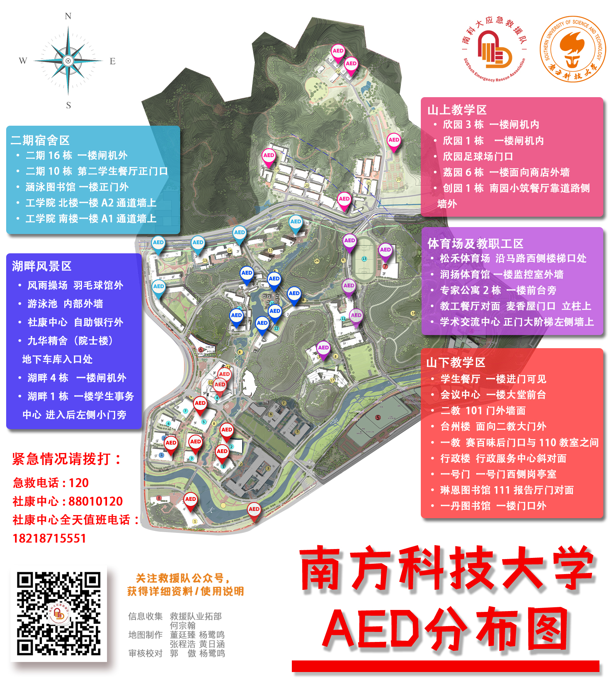
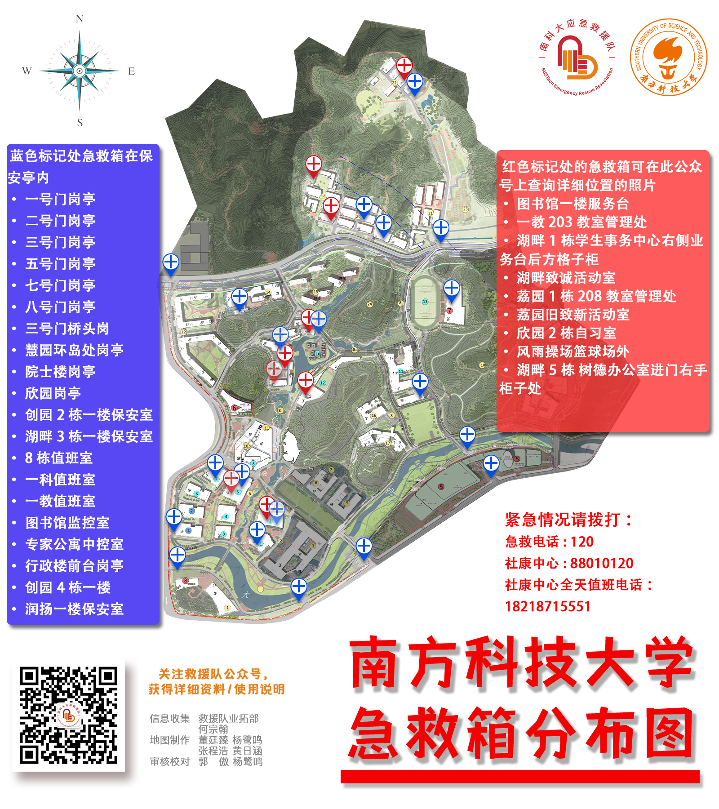

# 应急处理

::: danger 生命安全优先

发生危及生命的医疗急症时，请立即拨打 **120**。不要等待校内人员到场后再呼叫急救，也不要用本页的校园联系电话替代 120。

:::

## 医疗

### 紧急医疗

1. **立即拨打医疗急救 120**，清楚说明患者状况、具体位置、附近建筑或入口，以及回拨电话。
2. 在不耽误 120 呼救和现场急救的前提下，可拨打学校保卫部门 24 小时报警求助电话 **0755-88010110**，请其协助引导救护车和处理校内通行。
3. 校医务室（校园诊所）联系电话为 **0755-88010120**，可用于校内医疗咨询或衔接；该电话不能替代 120，也不在本页承诺 24 小时接诊。
4. 经过紧急处置后，可查看[就医指南](/service/medical-treatment/README.md)。

以上电话和处理顺序依据学校[联系电话目录](https://www.sustech.edu.cn/zh/contact_us.html)及[校方主办的 2026 年会议服务页所列医疗信息](https://icsa.sustech.edu.cn/)整理；后者是日期化来源，不是持续维护的医疗门户。

### AED 与急救箱历史地图

::: warning 时效提示

以下地图为本站保存的历史资料，无法仅凭互联网公开信息确认每台 AED、每个急救箱目前的位置和可用状态。请优先寻找现场 AED 标识并询问保卫或场馆工作人员；寻找设备不得延误拨打 120 和实施力所能及的急救。

:::

#### 校内 AED 历史地图（南科大应急救援队）

#### 校内急救箱历史地图（南科大应急救援队）

### 2020 年应急手册（历史资料）

- [南科大应急救援队《应急手册》（2020）](https://mirrors.sustech.edu.cn/git/sustech-online/sustech-online-ng/-/raw/master/docs/emergency/应急手册Emergency_manual2020.pdf)
- 该手册可作基础知识参考，但内容和联系方式可能已经变化，不能替代 120 调度员指引、医务人员处置或经认证的急救培训。

## 财物与治安事件

- 遇到正在发生的盗窃、暴力或人身威胁，立即拨打 **110**；在校内可同时联系学校保卫部门 24 小时报警求助电话 **0755-88010110**。
- 保护现场并保存时间、地点、物品特征、支付记录等线索。不要因自行追赶、对峙或调取监控而增加人身风险。
- 监控资料涉及隐私和权限，当前申请方式请直接向保卫部门确认。本站保存的[旧版监控调取审批流程及申请表](https://mirrors.sustech.edu.cn/git/sustech-online/sustech-online-ng/-/raw/master/docs/emergency/监控调取审批流程及申请表.pdf)仅作历史参考，不代表现行流程。
