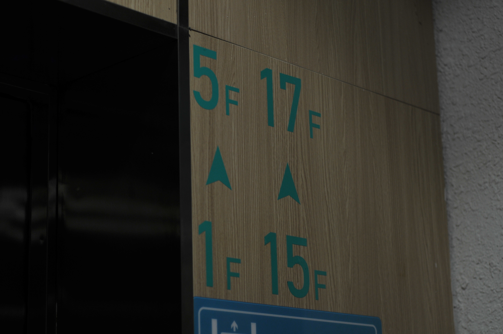
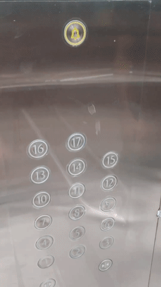

# 如何“破解”11栋电梯

by 曹正阳

# 事先声明

## 安全

电梯是特种设备，和人身安全直接相关，请严肃的使用电梯。本文目的是为了给大家丰富眼界，不鼓励效仿，你的安全需要你自己负责。

## 背景介绍

本文主要写给11栋土著，但以防你没有11栋住宿经验，简单介绍一下11栋的电梯。

11栋共有四部电梯，除消防电梯外，其余三部因为人太多，限制了每部电梯的具体到达楼层。

比如2号电梯可以到达1～2楼，11～14楼。

长久以来，三部电梯只能使用一部。即使当所有电梯都空闲，你也只能选择对应的一部，不免有些难受。

# “破解”流程

## 使用其他电梯去到目标楼层

## 前提条件

**除了你，没有其他人在使用电梯。**一般这种情况会发生在深夜和假期人少的时候。

### 原理

开始长按某个楼层键的一瞬间，意味着取消去往这个楼层。当电梯只有一个目的地，即面板上只有一个楼层的按键亮着，长按这个个亮着的按键不到两秒，电梯会在当前运行位置停下来，松手按键变暗。再按开门键，你就可以到达运行停止位置的楼层。

图仅仅在演示长按可以取消，此时电梯还是会前往1楼。

### 具体操作

假设你是一位11楼的住户，刚踢完球大汗淋漓。和你一同等待电梯的，**只有**一位刚结束学习的13楼住户，你不想给这位13楼住户留下不好的印象，于是你进入了最右边的3号电梯。

你按下了15楼的按钮，但你不是真的要去15楼。

在电梯数字快要跳到11楼时，你开始长按15楼按键，电梯失去了目标，停在了11楼。松开按着15楼的手，面板上15楼按键熄灭。

于是你潇洒地按下开门键，你来到了11楼，看着2号电梯屏幕上残留的13，你满意地离开。

## 从2楼下到1楼

### 前提条件

首先电梯不能从2楼下行到1楼（截止2022年8月，11栋2楼因为怕人多从2楼蹭电梯，所以不能下行）

然后**除了你，没有其他人在使用电梯。**一般这种情况会发生在深夜和假期人少的时候。

### 具体操作

先按下2楼某一部电梯的上行键，待电梯开门后，按下1楼的按键，电梯会迟疑一会然后下行。

# 总结

### 使用其他电梯去到目标楼层

不管用不用，增加了一种上行方式，能够有得选总是好的。

中、低楼层的同学除特定电梯、楼梯外，还多出另外一部或两部电梯的特定使用权。而15～17楼的高楼层同学较为可怜，没有操作的余地。

### 从2楼下到1楼

增加了一种下行方式，能够有得选总是好的。