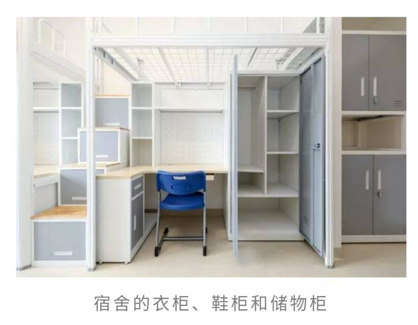

# 新生攻略之宿舍生活篇

*本部分由 致诚书院大学长团 提供*

首先，热烈欢迎大家来到南科大！大家会在11栋迎新楼度过大一一年的生活，等到大二再搬到书院的住宿区和书院的前辈们住在一起噢。

宿舍是我们每一天的起点和终点，下面小编就以11栋宿舍为中心按照衣食住行用分类跟大家讲一下吧\~

[[toc]]

## 一、住，豪华宿舍配置

宿舍楼单层的**平面图**在这里啦，两端是楼梯和卫生间，楼层东侧有额外的消防电梯。中部是功能区，有公共晾衣间、饮水机、电梯和小活动室。小活动室中配有桌椅和沙发，还有冷藏冰柜和微波炉，夜宵好去处（划掉）。

Ps：下头这个图是自己画的，大家凑合着看看就行哈哈哈。

公共晾衣间内有撑衣杆，鞋子也可以在这里晾晒，晾晒完毕记得及时取走自己的衣物。饮水机也被放置在这里，提供热水和常温水，热水记得看饮水机上的**温度显示**，如果接了温水泡面的话 😭（难受）。

日常用电梯共有三台，是**分楼层停靠**的，大家注意每个电梯的停靠楼层。电梯高峰期人很多，比如中午时间段大家上下楼比较频繁，建议尽量错峰或者走楼梯锻炼身体doge。

楼层两侧的卫生间有洗漱台和[独立的淋浴间]，淋浴记得插卡使用热水。如果遇到插卡不出热水的情况，可以先检查自己的学生卡是否进行了**热水充值**，开学充值一元后期无限使用，也就是说热水是免费的哦。还是不可以的话可以找到宿管老师询问情况。

接下来就是宿舍内部啦，宿舍都是四人间，每人都是标配的**下桌上床**。宿舍的储物空间还是非常大的，门口有双层柜，床下有衣柜和一个小侧柜，而且床侧楼梯也是**隐藏的柜子**哦。衣柜里的**隔层板是可活动的**，可以根据自己的需求大小调整。窗外还有一个小的晾衣杆，如果内衣裤不想拿到公共晾衣间的话，晾在这里就好啦，不过记得**用夹子固定一下**，如果被风吹下去就\...\

## 二、食，只隔一条马路的双层复式食堂

校内共四处学生食堂，按照距离11栋远近来说：10栋第二学生食堂，也就是常说的新生食堂，荔园食堂，一教食堂和中心食堂。还有一处欣园食堂，不过大家很少会在那里吃饭。新生食堂周内有时也会供应夜宵，大家可以注意一下食堂的通知哦。大家日常吃饭其实还有很多选择，比如赛百味、肯德基或者南科麦香屋（面包坊）等等，详细的介绍可以参考之前的新生攻略之食堂篇。小声：校外也有很多好吃的噢，大家加油寻找吧\~

## 三、衣，24h自助洗衣系统

在宿舍楼2层东侧有洗衣间，洗衣机、烘干机和洗鞋机一应俱全。手机上下载**海狸洗衣APP**，可以实时查看洗衣机的使用情况，进行预约或者使用。**男女生的洗衣机是分开的**，大家使用时注意区分。其中也有一套**大号洗衣机和烘干机**可以清洗被褥等大号衣物。**请不要在洗衣机里清洗内衣裤和袜子等，保持自己和他人的卫生健康。**衣服清洗完毕及时从洗衣机内取走，不然很可能被拿错哦。

各大应用商店均可下载，本图截取自小米应用商店

## 四、行，地处学校中部的黄金地带

因为学校的地势呈一个**斜坡**，而11栋正好处于坡的中部，再向上是荔园和欣园，向下则是教学楼图书馆等，所以去哪里都比较方便啦。11栋楼下有学生宿舍校巴站，疫情期间大家乘车需要**佩戴口罩**哦。因为学校的斜坡地势，**想购买自行车的同学**注意了，骑下去很爽，但骑上来还是挺累的，建议购买**可变速的自行车**。深圳的太阳很毒，而且有时会发生短时强降雨，大家出门记得一定要带**防晒**和**晴雨伞**呀。

## 五、用，其余的生活使用细节

宿舍楼旁边的十三栋配有**天虹超市**和**快递收发室**（广东省深圳市南方科技大学13栋快递收发室），大家采购和网购都很方便啦，也可以向外寄快递的。当然有时候快递公司会把快递投放在快递柜中，一般会放在**8栋快递柜**，在新生食堂西侧，涵泳图书馆南侧一层。大家可以在手机上关注微信公众号**近邻宝校园**，绑定好手机号后就可以方便地在手机上看到自己的快递是否到达啦。

**宿舍用电**每人都有每年120度免费额度，超额度是会断电的，大家要节约用电呀。宿舍内电器功率不得超过1500W。电控系统会在每年2月末和8月末按照宿舍人数进行充值。如果遇到度数不够使用的话，可以在南方科技大学企业微信中进行**水电充值**，点击水电充值，绑定好房间即可充值。**饭卡充值**也是在这里的，点击校园卡选项，进入充值界面即可。\
全校范围内提供**免费的WiFi**，大家认证登录后就可以免费使用了。

如果有小可爱不小心**丢失了自己的校园卡**可以通过以下两个方式补办噢（**注意！！！任选其一！！！不要两个都弄！！！**小编曾经两个同时进行然后一次补了两张卡，痛苦面具 😭。
①在**琳恩图书馆**或者**书院一栋学生事务中心**的[自助补卡机]进行补办，需要扣款20元作为补卡费用，保证卡里有足够的金额就好。可以当场取卡，但是**门禁**需要过[几个小时]才能转移成功，新卡是**不支持1元热水继承**的，需要再进行热水充值。\
②在**南方科技大学企业微信**进行挂失补卡，在微信上付款等待补卡通知，补好后会有老师通知去**书院一栋学生事务中心**领取。

还有一个小提醒，宿舍内还是需要配备**蟑螂药**的，11栋宿舍楼虽然很新，但是深圳蟑螂更强（卑微.jpg），保持宿舍内干净卫生，做到有备无患就好啦。如果在宿舍楼内发现蟑螂，可以向宿管老师报备，联系专业的杀虫人员处理。宿舍楼应该会建立一个新生宿舍微信群，大家有任何情况都可以在微信群里向宿管老师反应。

好啦，这就是宿舍生活的大致情况啦！大家还有什么问题都可以在群里提出，大学长们会耐心解答的，希望大家在宿舍都能开心每一天！

**图片来源：**
南方科技大学官网、南方科技大学致诚书院微信公众号、我的手机

**资料参考：** 2020级新生攻略之宿舍生活篇

**制作：致诚书院大学长团 闫瑞泽**

致诚书院出品，本文已获授权在 sustech.online 转载，转载请注明出处。

