# 新生攻略之校内介绍篇

*本部分由 致诚书院大学长团 提供*

[[toc]]

## 食堂篇

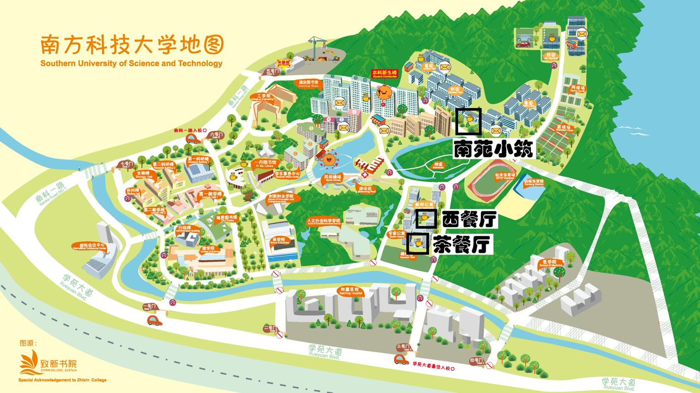

### 1. 高消费餐厅

**1）西餐厅**

正如其名，牛排、烩饭、扒类、鹅肝等菜品在西餐厅一应俱全，橙宝开学时和导师在这里聚餐后就念念不忘呢\~偶尔想去奢侈一把的话要记得提前预约哦！
人均：120 - 150元

**2）茶餐厅**

好吃的中式共享菜，在西餐厅旁，位置较为隐蔽。 人均：30 - 50

**3）南苑小筑**

坐落在润扬斜对面，南苑小筑店面复古，港味扑面而来。橙宝超爱和朋友一起去吃南苑小筑的各种扒餐、焗饭、中式简餐、港式云吞面和共享菜。它对犯懒的阿宅们也十分友好，可在公众号点餐，由小哥送到大家宿舍楼下呢！
人均：30 - 60元

### 2. 新生食堂

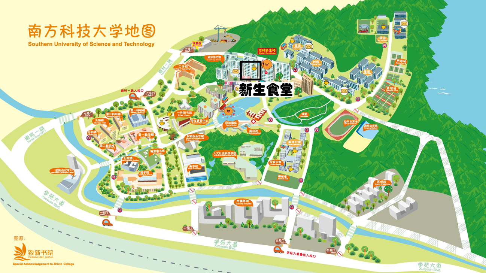

**早餐（7:00 -- 9:00）**

十栋食堂提供中西式点心、粥、茶叶蛋等常规早餐。其中不得不强调靠门窗口的肠粉，橙宝可是心甘情愿为它早起排队的哦！
人均：5 - 10元

**午餐&晚餐**

1）十栋

一楼：自选窗口中提供小盘菜、卤肉套餐、海南鸡套餐、水煮肉片等，其中金灿灿的绝美鸡米饭绝对值得一试！肠粉窗口在中午提供面食，不过调料、种类都较少，大家可以自己多多尝试\~

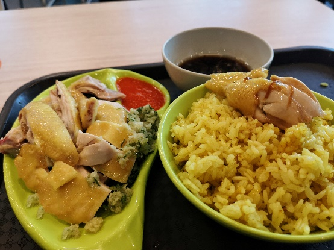

二楼：西式套餐（炒饭或意面+蔬菜+肉排+酱料）。分量很足，连橙宝都吃撑了呢。

2）九栋

一元一个的好吃水饺（有怪怪的茴香口味）、广式煲仔饭、自选小盘菜（提醒大家看清价格，合理搭配！不然很容易一顿30元+）。

夜宵：

包括粥、汤圆、炒粉等等，晚课后的心灵抚慰\~

硬件配置：微波炉、饮水机+杯子

9.  十栋小盘菜均价：12-25元

九栋煲仔饭均价：15-20元

十栋西式套餐均价：20元

十栋面食均价：15元

### 3. 中心食堂&湖畔食堂

**1）中心食堂**

作为2020年末冉冉升起的新星，它左连一丹图书馆，右接第二科研楼，且入驻了面点王、KFC（含早餐）和茶米相期门店，让你在校内也能尝绝美点心、吃汉堡炸鸡、喝果茶奶茶。

橙宝告诉大家一个小秘密：在面点王一次性点两块酱骨架，小哥有时候会给你三块哦\~

面点王均价：15 - 25元

橙宝高声呐喊：食堂自营的菜品也是一绝！！

**早餐：**

和新生食堂相似，但**只在周末**提供哦\~

**午餐&晚餐：**

各窗口包含风味面食、定制小炒、东北炖菜、潮汕卤味套餐、麻辣烫、大众菜等等。味道惊艳舌尖，价格并不很高。

均价：10 - 30元

大众菜窗口旁有贩卖饮品的大冰柜

**2）湖畔食堂**

**早餐：**

和新生食堂相似，**只在周中**提供哦\~

**午餐&晚餐：**

以最高的性价比傲视群雄，它的大众菜包含5元、3元、1元的菜式，小炒鸡柳、菠萝咕噜肉、煎鱼等菜式相当好吃，非常适合吃土的少男少女。（但橙宝有时候也会被略过重的油量狠狠油到）进门左手边的面食窗口也提供炸酱面、番茄鸡蛋面、猪杂面等多个选择。

大众菜均价：6 - 9元

面食均价：10 - 15元

小卖部：

在自选窗口对面，售卖奶类饮品、咖啡和平价小面包。

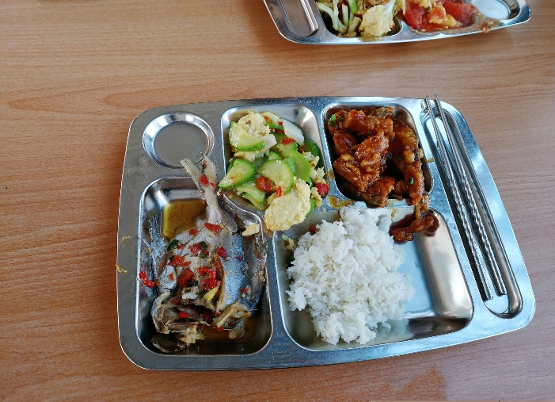

### 4. 欣园食堂&荔园食堂

**1）欣园食堂**

欣园食堂比较遥远，大家去的机会比较少，但是仍然十分的美味。

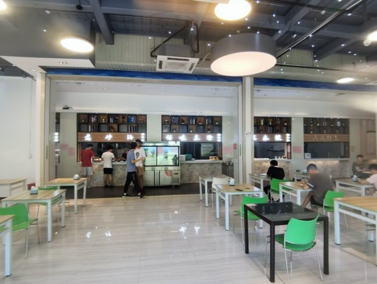
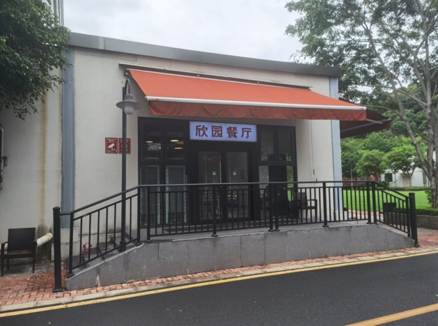

**2）荔园食堂**

橙宝在荔园下课后的第一目的地，就是六栋的荔园食堂啦。

**早餐（7:00 -- 9:00）**

和新生食堂相似，但是种类更丰富，橙宝觉得荔园的肉包更好吃\~

**午餐&晚餐：**

一楼：得到众多好评的大众菜，不过价格多变，一定要看好价格哦。

二楼：学校食堂中TOP水平之一，据说这里有学校最好吃的面！其他窗口也提供包含鸡排饭、特色小碟菜等菜品，橙宝都很推荐。

一楼均价：8 - 15元

二楼均价：15 - 20元

【Tip：传统食堂都需要大家倾倒食物残渣，回收餐具，一定不要忘了哦。】

### 5. "非常规"餐厅

**1）赛百味食堂**

坐落在第一科研楼与第一教学楼之间的经典快餐店，售卖自选夹层的美式三明治、小块披萨、鸡肉卷、薯宝、鸡翅、曲奇等小吃。校内折扣也挺香的，大家可以理性尝试\~

均价：20 - 30

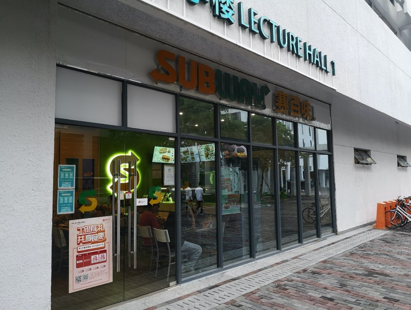

**2）星巴克食堂**

小资情调、少人排队的高贵星爸爸，除饮品外提供美食三明治、千层面、精致小蛋糕等，是在琳恩图书馆学累了下来放松的优选。
均价：30 - 40

**3）超市食堂**

唯一的全天候营业的食堂，懒觉者的早午餐唯一指定食堂，你面对其他食堂排队长龙望而却步时的好去处，主要有湖畔超市、荔园超市、天虹微喔三家，提供车仔面、关东煮、各种熟食与面包。此外，天虹提供加热、煮面的服务哦\~但是橙宝告诉大家，在妮可，不多吃正经食堂的话是会后悔的！

**4）学者咖啡&湖畔一栋致仁咖啡社**

第二科研楼一楼的学者咖啡提供咖啡、超级美味的饺子、牛肉面和冰淇淋（听说在哪里可以经常遇见留学生哦）

湖畔一楼的咖啡社环境和氛围也非常棒哦。

以上就是妮可的食堂介绍啦，橙宝希望大家可以在南科大吃的开心。校外还有更多的深圳美食，大家可以移步至本公众号相关推送查看。

## 学习场所篇

### 1. 两个主要教学区域

说到上课，妮可主要有两个教学区域：**第一教学楼**和**荔园**

**1）第一教学楼**

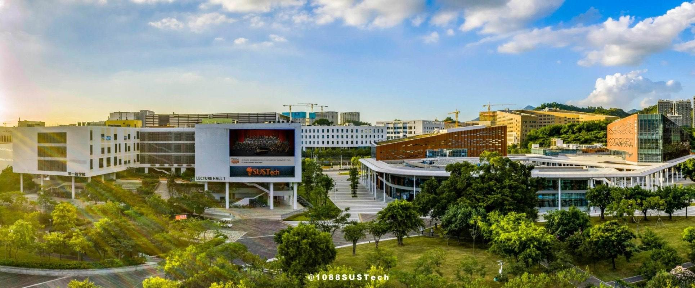

门外的超大显示屏，滚动播放学校最新动态

一楼宽阔明亮的教室，有时有名叫"麻酱"的猫猫出没哦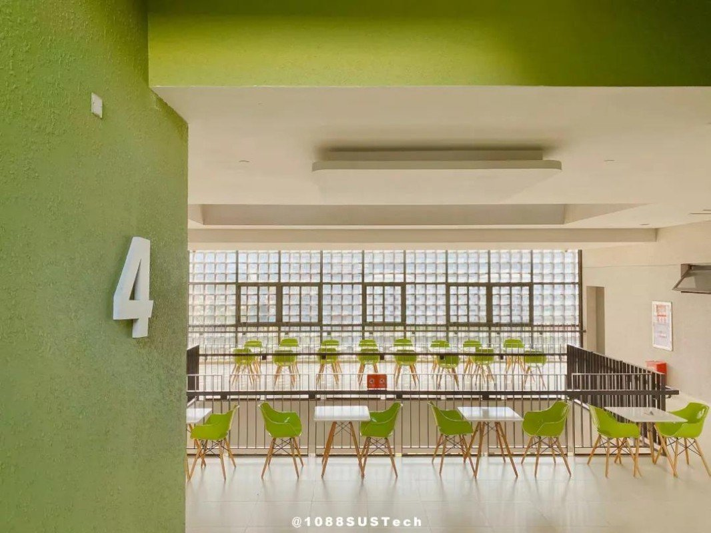

高层也有让人心旷神怡的露天平台\~

而一教隔壁的 **第二教学楼** 布满机房，是计算机系上机课程的授课场所

**2）荔园**

相比一教，荔园多出的实验室和机房为各专业实验课提供场所。其他和第一教学楼相差不大。

略显抽象的夜景

阶梯教室

不知不觉就下课啦！橙宝知道努力的大家没有学够，想温习刚刚学过的知识。这时除了一教和荔园的**空教室**都可以进入自习外，**图书馆**更是一个很好的选择！

### 2. 图书馆

学校里共有三个图书馆：琳恩图书馆，一丹图书馆，涵泳图书馆

**1）琳恩图书馆**

位于第一教学楼对面，下课后来这里很方便。

一楼门口有一家星巴克，可以带杯咖啡优雅地进馆自习！

一楼自习区左侧是美丽落地窗，同时有打印机、自助借还书机和图书杀菌机、半开放讨论区

二楼有半开放讨论区

图为三楼睡觉区，同时也有电脑区、大量藏书

**2）一丹图书馆**

一丹图书馆由慈善家陈一丹先生捐赠，分为24小时开放的一楼自习区和**8:00 --
22:00开放**的其余楼层，白天入馆记得走二楼大门哦！

**一楼**是通宵自习室，来这里学习的人非常多，临近考试的时候更是座无虚席。也有舒适的小沙发哦【Tip：一楼大门仅在22:00-次日8:00开放】

**二楼**有藏书室（含打印机）和电脑区

**三楼**有半开放讨论间、封闭式讨论间（后者需要在官网预约）。同学们可以在这里组队学习，还可以借用白板、投影等设备\~

**四楼**是常规自习室。这里可以看到湖畔美丽的景色，橙宝超喜欢的！

**3）涵泳图书馆**

包含自习室、讨论间，室内可漂亮了，不过位置相对较少。

### 3. 科研楼

**1）第一科研楼**

在第一教学楼对面，一楼的报告厅承办许多活动和讲座（e.g.
书院教育讲座、s赛决赛线下观赛活动地点）

二楼有联创打印机，在一教打印机坏了或者没纸的时候能来这里救急哦

**2）第二科研楼**

教授们的办公室、院系的实验室

**3）第四科研楼**

步道乐跑的打卡点，到时候跟着导航走就好啦

### 4. 院系大楼

**1）工学院**

新建成的理工院楼中老师们已经就位，实验室在陆陆续续往里面搬迁

**2）理学院**

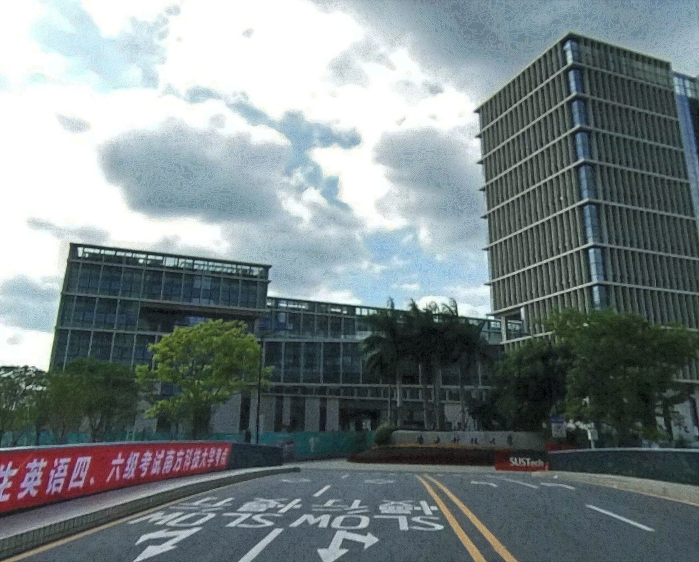

一号校门进来的大楼就是理学院！

**3）商学院**

**4）人文社科学院**

人文社科学院老师的办公地点，为学校增添许多人文、历史气息

除了上课和科研，橙宝呼吁大家多多去老师们的\[**办公室**\]提问哦！主要分布在第一教学楼，科研楼，院系大楼，慧园，人文社科学院，具体位置请积极询问老师\~

## 运动场所篇

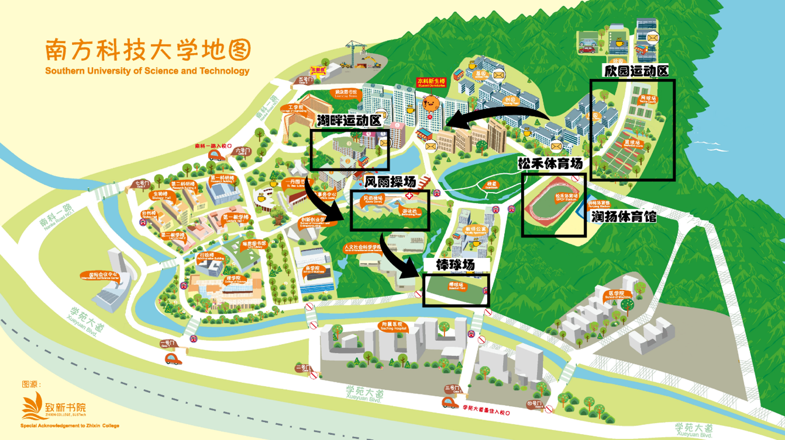

图：介绍顺序一览

### 1.欣园区

**1）篮球场**

一共有10个全场，是全校最大的篮球场

**2）足球场**

五人制小场，一共有两个全场，可以在这里举行一些小型比赛

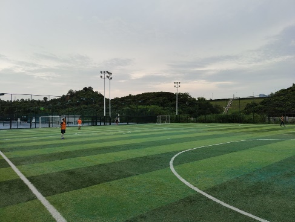

**3）网球场**

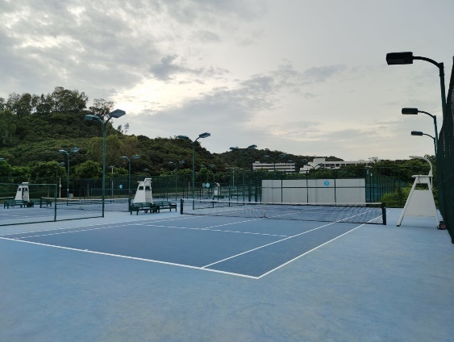

### 2.松禾体育场 + 润杨体育馆

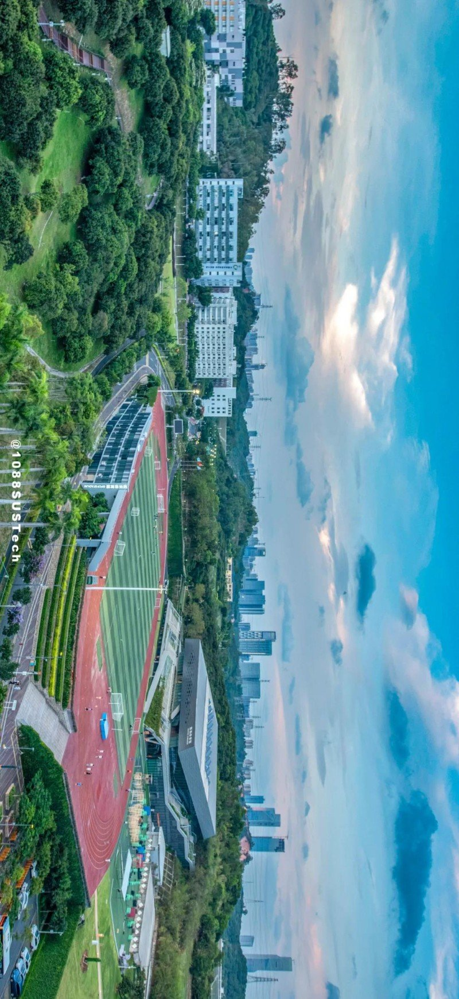

**1）标准400m跑道+标准足球场**

**2）真人cs场地&攀岩墙（跑道旁）**

cs随时都可以打，只需要提前预约就可以啦

攀岩墙一般供体育课中的攀岩课教学使用

**3）室内羽毛球场**

位于润杨体育馆一楼，有大型活动时会撤去场地，提醒大家留意邮件通知哦

**4）润扬健身房**

润杨健身房位于润杨体育馆四楼，24小时开放，较湖畔健身房设施更全，内有各种自由、固定器械，还配备空调，饮水机和淋浴间。

### 3.湖畔运动区

**1）湖畔健身房**

24小时开放，相比润扬健身房空间较小，固定器械较少。

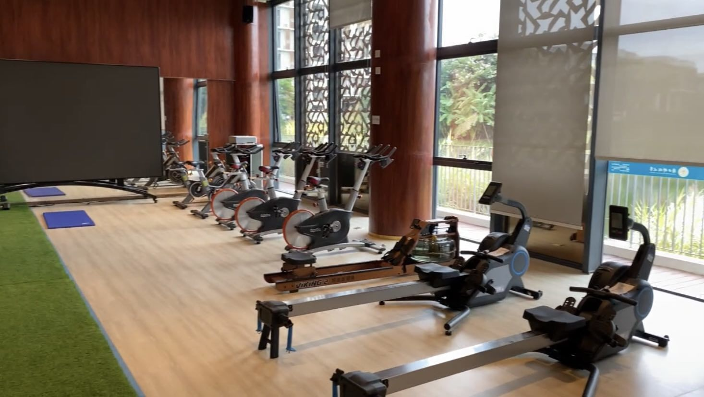

**2）舞房**

位于湖畔健身房隔壁，配有空调和音响，是体育课和社团课的授课场所，没有课程时可以随时进去热舞。

**3）乒乓球馆**

位于湖畔四栋楼下，共有十几台乒乓球桌，随时开放。

**4）台球馆**

位于湖畔二栋楼下，有两个九球台和一个斯诺克台，同学们只需要向宿管交**50元现金押金**就能开桌啦。

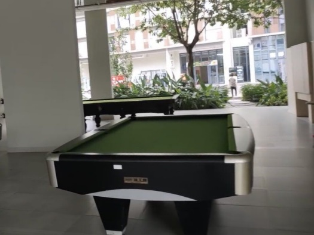

### 4.风雨操场

**1）篮球场**

是室内篮球场，只有一个全场，记得要预约哦

**2）排球场**

**3）拳击馆**

**4)游泳馆**

户外游泳池，只有夏天开放，记得留意邮件通知哦

### 5.棒球场

一大片用来打棒球的草地，也是棒球课和棒球社社活的场地。

## 活动场所篇

**1. 致诚活动室**

当你想和朋友一起玩玩桌游，当你想和你的ta一起坐下来好好聊聊天，当你突然需要小组讨论，当你想找个地方躲避炎炎夏日，当你手痒想弹弹钢琴\...\...这些问题都有同一个答案：去致诚活动室啊！

致诚活动室位于湖畔三栋对面，左临湖畔超市、右接健身房舞房，旁设有会议室。内设台灯、桌椅、沙发、钢琴与适量书籍等，组成它温馨明亮的室内布置。活动室是与朋友玩耍、多人聚会的好去处，有时也会举行橙子节、音乐角等书院活动。

【橙宝提醒大家：休息时段玩耍请注意控制音量哦！】

**2. 学生事务中心**

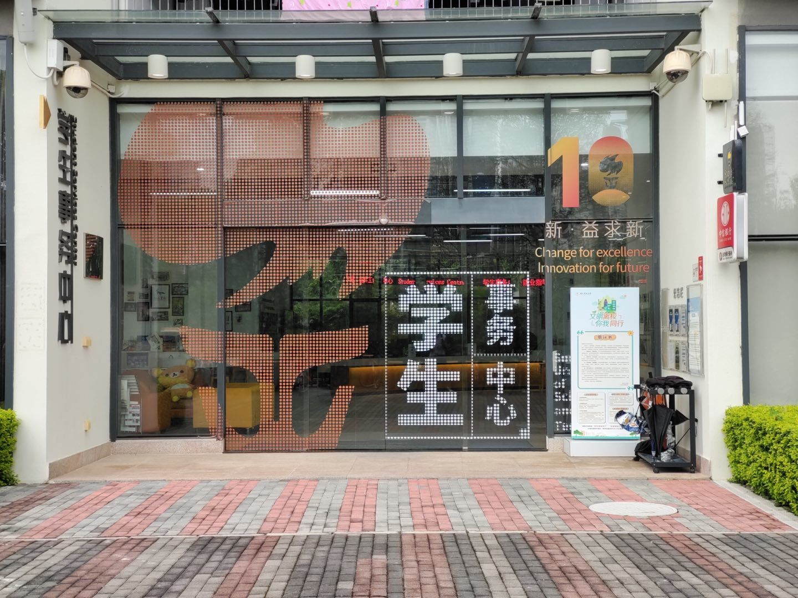

学生事务中心位于湖畔一栋，内设有失物招领处与补办学生卡的机器（橙宝祝大家永远不要使用它，但补办新卡时不要忘了冲一元水费哦），学校开通银行卡、高铁优惠票等业务也很可能需要到这里办理。

**3. 社康中心**

社康中心上接十一栋，下接教师公寓，旁临游泳馆。若大家有任何身体状况，都可以前往此处挂号就诊。一定记得听从医嘱，该去大医院检查一定要去，在学校要照顾好自己嗷。

**4. 国际会议中心**

一号门旁的豪华会议+表演场所，校庆、跨年晚会（十佳歌手总决赛）等等大型节目的举办场地。

> 

**5. 教工之家**

位于教师公寓内，坐校巴到专家公寓站即可快速到达。它是每年致诚生日会的举办场地，同时也大概率是致诚舞会的举办场地。

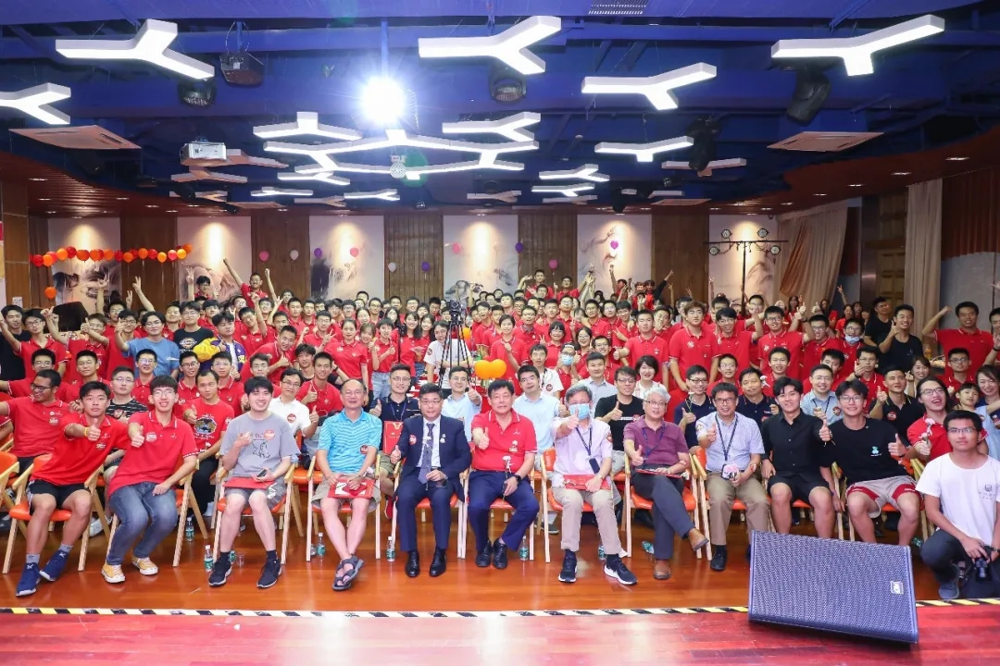

**图片来源：**
1088SUSTech，致新书院，SUSTechOnline，卓著，郑微言，邬静芙

**资料参考：** 南方科技大学致诚书院公众号

**特别鸣谢**： 致新书院提供校园地图

**制作：致诚书院大学长团 邬静芙，郑微言，卓著**

致诚书院出品，本文已获授权在 sustech.online 转载，转载请注明出处。