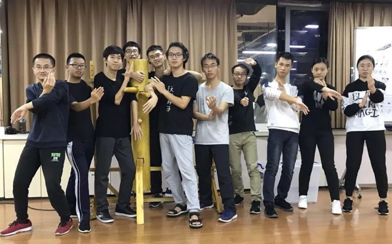

# 新生攻略之社团篇

*本部分由 致诚书院大学长团 提供*

[[toc]]

## 前言

欢迎各位2021级的新生们加入南科大！刚刚结束高考的你们，一定对未来的大学生活充满了期待吧！相信，你也想要拥有丰富多彩的大学校园生活，如此，社团活动又怎能缺席！

南科大目前共有社团百余个，主要分为思想政治、学术科技、创新创业、文化体育、志愿公益五个大类。社团为爱好相同的同学们提供了相聚相识、交流进步的平台，也为有一技之长的同学建立了提升能力、展示自我的机会。加入社团，不仅可以强化相关领域的技能水平，还可以在培养兴趣爱好的同时，提升个人人际交往能力。

本篇攻略，就让橙宝带你了解南科大社团！

## 一、如何选择合适的社团？

想要加入社团却不知道如何了解社团？不要担心，"百团大战"就是你了解社团的好时机！南科大社团联合会会在每年初秋举办一年一度的"百团大战"活动，届时，各个社团都会精心布置自己的摊位，展示自己的风采，张罗来往同学驻足观看，给予同学们了解社团、加入社团的机会。此外，有的社团也会利用qq空间或是微信公众号来进行宣传，同学们可以多多留意。遇到感兴趣的社团，也不妨加入该社团的招新群了解一下噢\~

在这里还有一个小小的提醒，有些社团由于受到特定书院管理，名字前会加上该书院的名字（如致诚咏春社、致仁民乐团等），但这并不意味着其他书院同学不能加入该社团噢！在南科大，所有社团都是面向全校同学开放的，只要你有兴趣，就去报名参加吧！

## 二、学生社团联合会注册社团名单（截止2020.9）

### **思想政治类**

学生研习社

### **学术科技类**

航模社 社团数学物理社 DataHub社团

材料研究学会南科大学生分会 工业设计社 计算机研究协会社团

深渔俱乐部 虚拟现实技术社 自主智能机器人社团

### **创新创业类**

未来企业家俱乐部 创新创业协会

### **文化体育类**

致仁民乐团社 辩论社 Wink舞社

定向越野社 乒乓球社 桥牌社

东亚神话与邦乐研究社 书画社 跆拳道社

清羽飞扬羽毛球社 自然国学社 Dauber画社

树礼微电影社 搏击社 川衡社

树仁钢琴社 电竞社 NOVA街舞社

文化创意社 翻译社 吉他社

致诚歌唱社 猫社 南风诗社

树礼阿卡贝拉社 武学社 日语社

致诚设计社 西乐社 校园大使

雁落弓社 弈林棋社 游戏王社

致诚咏春社 游泳社 万智牌社

致仁烘焙社 电影沙龙社 篮球社

南枝未央汉服社 网球社 树礼科幻协会

SCAP动漫社 轮滑社 魔方社

致仁咖啡社 致诚健身社 Susmusic树礼说唱社

炽焱足球社 排球社 树仁京剧社

电影沙龙社 音乐剧社 瑜伽社

电子音乐社 拉丁社 风华主持队

女子篮球社 天文社 推理社

橡树调酒社 围棋社 文学社

致新非物质文化遗产社 致新古琴社 野战社

树德力量举社 开言堂相声社

### **志愿公益类**

绿足迹自然保育社 树礼科普社 招生宣传协会

### **其他类**

花粉俱乐部

### **筹备社团**

军事爱好者社团（筹） 粤语社（筹） 滑板社（筹）

大学生就业与职业发展社团（筹） 棍网球社（筹） CAN极客社团（筹）

空手道社（筹） 理想社（筹） 模拟联合国协会（筹）

绿色智慧校园社（筹） 轻小说社（筹） 摄影社（筹）

行水国风音乐社（筹） 狼人杀社（筹） 致仁微创社（筹）

海洋机器人社（筹） 立直麻雀社（筹） 美丽中国教育协会（筹）

电声乐社（筹） 树德STEAM+创客教育社团（筹）

(部分社团可能已转正，该名单仅供参考)

Ps：部分社团（如合唱团、舞蹈团、季风剧社等）直接由艺术中心管辖，加入需要进行具有相应的能力，并经过选拔，不归属社团联合会管理，故未包含在本名单内。敬请谅解！

## 三、致诚书院特色社团

### 致诚健身社

致诚书院健身社于2020年初开始策划，2020年七月正式成立，现有社员约25人。社团目前设有社长一名，由致诚书院2020级陈孙兵担任；副社长分别由2018级侯文楚、2019级杨扬和2020级黄宇海三位同学担任。设有指导老师和指导教练各一名，分别由致诚书院辅导员张瀚文老师和颜永涛教练担任。社团指定活动室为致诚书院三栋楼下健身房。

致诚书院健身社的宗旨是通过专业、科学的训练方式，提高运动表现力，提升个人自信，丰富课余生活，从而达到快乐健身的目的。健身社不只关注训练健硕的肌肉，更重要的是，希望通过综合性的训练，提高基础力量和核心力量，从而提高个人在篮球、羽毛球以及排球运动等中的表现力。所以，无论是健身小白还是健身大佬，在这里，都能找到适合自己的位置。

### 致诚歌唱社

歌唱社全名"南方科技大学致诚书院歌唱社团"，由校内爱好唱歌的学生组成，由致诚书院和艺术中心共同指导及管理。南方科技大学在籍学生，只要对唱歌有浓厚兴趣，具备一定的声乐基础，遵守本社团章程，皆可申请入社，通过面试考核即可正式成为本社社员。预计每学期招收新生20位以内。

歌唱社社内氛围良好，一群志趣相投的同学们聚集在一起，不分年龄，有的只是对唱歌和音乐的共同信仰与追求。大家在歌声中相识，用音乐传递快乐，用音乐互相鼓励。

社团拥有强大的专业辅导老师阵容。社团成员们更是活跃在学校内各类大、小型舞台、晚会上。2020年南科好声音十佳歌手有七位来自致诚歌唱社，校庆晚会的舞台上也经常出现着歌唱社成员的身影。我社在2020年成功举办致诚音乐角活动，并在2021致诚橙子节音乐表演中获得成功，同学们反响良好。

致诚歌唱社荣获2020年度艺术中心优秀社团一等奖。

### 致诚设计社

致诚设计社是由致诚书院和艺术中心共同指导的艺术社团，旨在让学生了解平面设计的基础理论和知识，包括海报设计、logo设计、包装设计等，同时也致力于提升学生的设计应用能力，激发想象力和创造力，培养学生的设计思维，致力于学生审美素养的提升。

设计社每周安排一节培训课，由知名的专业设计师Max和Christy进行指导，课堂有趣又实用。同时，设计社经常现身于学校各个活动中，每次都给同学们不一样的创造体验。设计社的同学们也有更多机会去尝试设计出不同的作品，有机会出现在书院或学校组织的展览中，以及为学校活动进行logo、海报等设计哦！

### 致诚咏春社

在致诚咏春社，你将获得：

专业的咏春教练！手把手的精准指导，让大家的练武路上从不迷茫。

负责的练教课堂！除了有教练前来的正课，为了保证部员们的练习质量，我们还在每周周三周五自发组织，由学长带头的自主练教课程！

温馨的社团氛围！温暖的社团环境，更是给了大家在练习的辛苦中的一丝甜津。

## 四、创建社团

如果你没有找到喜欢的社团，你可以选择联合小伙伴一起创建社团哦。根据社联要求，一个社团的成立需要至少 10 位发起者（有可能修订到更多人数）以及相应的指导老师。如果条件尽数满足的话，那就可以轻松的组建自己的社团啦！不过作为新生入学，橙宝还是建议第一年尽量避免进行一些如同创建社团这样的耗费精力的活动，毕竟学习要紧哦！

## 尾声

社团作为大学生活的调味剂，可以使我们在学习之余获得丰富的课余时光，让我们在短暂休息的同时收获珍贵的友谊，变得更加积极。同时橙宝也要提醒各位，在加入社团收获快乐的同时，也不能忘记学业噢！如果本末倒置，那就太得不偿失啦！

本篇攻略到此就结束啦，橙宝在此祝愿各位21级的小伙伴们都能找到自己感兴趣的社团，收获充实又愉快的大学生活！

::: tip 版权信息
**图片来源：** 南科大社联菌公众号 南方科技大学致诚书院公众号

**资料参考：** 南科大社联菌公众号 社团联合会社团名单
南方科技大学致诚书院公众号

**特别鸣谢**： 致诚书院2020级大学长杜昊澄 帮我改文案的聪明人（x）

**制作：致诚书院大学长团 林瀚兰**

致诚书院出品，本文已获授权在 sustech.online 转载，转载请注明出处。
:::
