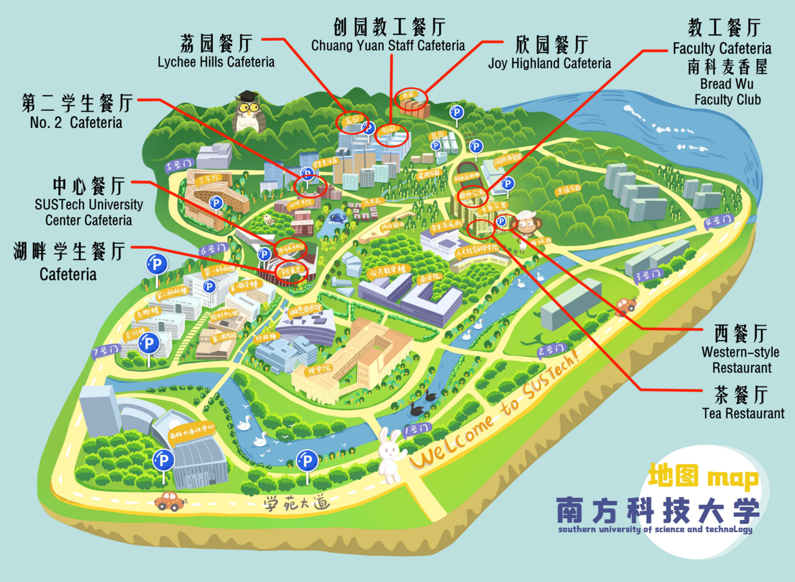

# ☕️餐饮

> 对于南科人来说，光顾得最频繁的餐厅当属校内食堂了。据不完全统计，只是学生食堂，每天就有4000+的客流量。出校吃饭的时间成本太昂贵，上课前下课后在食堂填饱空虚的胃是最好的选择。平心而论，南科大的伙食质量还是很OK的。价格也足够平民，正常情况下每餐成本可以控制在8-12元之间，很少有超过15元的。笔者在刚开学的时候爱上了食堂的肉末面，连着吃了一整个月。拉面，肉夹馍，小炒，白切鸡盖饭，夜宵特供麻辣烫，冬季限定小火锅……即使在平凡的食堂菜单中也能找到吃后可以感慨“人间值得”的好菜。

*——南科新知：[吃喝住行指南 | 新生攻略Vol.2](https://mp.weixin.qq.com/s/5wzuZjQ9uJacp4ioScBVww)*

## 校内餐厅

### 第二学生餐厅

#### 二期学生宿舍9栋

- 餐厅位置：二期学生宿舍9栋一层
- 供应品种：大众菜系、水饺、风味面食
- 营业时间：
    - 早餐：07:00-09:00
    - 午餐：11:00-13:00
    - 晚餐：17:00-19:00
    - 夜宵：19:00-22:00 (仅周一至周五开放)
- 经理电话：崔经理 18898832662

#### 二期学生宿舍10栋

- 餐厅位置：二期学生宿舍10栋一层、二层
- 供应品种：大众菜系、早餐肠粉、风味汤粉、卤水套餐、西式套餐、夜宵、烧烤
- 营业时间：
    - 早餐：07:00-09:00
    - 午餐：11:00-13:00
    - 晚餐：17:00-19:00
    - 夜宵：19:00-22:00 (仅周一至周五开放)
- 经理电话：崔经理 18898832662

### 中心餐厅

- 餐厅位置：南科大中心一层
- 供应品种：大众菜系、早餐肠粉、风味粥粉面、铁锅拌饭广式烧味、精美小炒、麻辣烫、小卖部、平价水果
- 外包档口：肯德基、面点王、茶米相期
- 营业时间：
    - 早餐：07:00-09:00
    - 午餐：11:00-13:00
    - 晚餐：17:00-19:00
- 经理电话：杜经理 13760335494

### 荔园餐厅

#### 荔园6栋一层

- 餐厅位置：荔园6栋一层
- 供应品种：大众菜系、卤水套餐、粥饼档、素菜
- 营业时间：
    - 早餐：07:00-09:00
    - 午餐：11:00-13:00
    - 晚餐：17:00-19:00
- 经理电话：黄经理 13430934058

#### 荔园6栋二层

- 餐厅位置：荔园6栋二层
- 供应品种：精美小炒、特色菜
- 外包档口：广东靓汤、西北面食、日韩料理
- 营业时间：
    - 早餐：07:00-09:00
    - 午餐：11:00-13:00
    - 晚餐：17:00-19:00
- 经理电话：黄经理 13430934058

### 创园教工餐厅

- 餐厅位置：创园2栋一层
- 供应品种：大众菜系 (午餐)、特色川湘菜 (晚餐)
- 营业时间：
    - 午餐：11:00-13:00
    - 晚餐：17:00-21:00
- 经理电话：黄经理 13430934058

### 教工餐厅(仅教职工使用)

- 餐厅位置：教师公寓2栋一层
- 供应品种：大众菜系、特色菜、风味面食
- 营业时间：
    - 早餐：07:00-09:00
    - 午餐：11:00-13:00
    - 晚餐：17:20-19:00
- 经理电话：赵经理 13456850850

### Faculty Club(仅教职工使用)

- 餐厅位置：教师公寓1、2栋之间
- 供应品种：大众菜系、特色菜
- 营业时间：
    - 午餐：11:20-13:00
    - 晚餐：17:20-19:00
- 经理电话：赵经理 13456850850

### 茶餐厅

- 餐厅位置：专家公寓1栋一层
- 供应品种：粤菜、客家菜、各地风味菜
- 营业时间：
    - 午餐：11:30-14:00
    - 晚餐：17:30-21:00
- 经理电话：赵经理 13456850850

### 西餐厅

- 餐厅位置：专家公寓2栋一层
- 供应品种：西餐
- 营业时间：07:30-22:00
- 经理电话：赵经理 13456850850

### 南科麦香屋

- 餐厅位置：教师公寓2栋一层
- 供应品种：面包、西点
- 营业时间：07:30-19:00
- 经理电话：赵经理 13456850850

### 湖畔学生餐厅

- 餐厅位置：大榕树旁一层、二层
- 供应品种：特色风味
- 营业时间：
    - 早餐：06:30-09:30
    - 午餐：10:30-13:30
    - 晚餐：16:30-19:00
    - 夜宵：19:00-22:30
- 经理电话：段经理 15012847432

### 欣园餐厅

- 餐厅位置：欣园5栋一层
- 供应品种：待定
- 营业时间：待定
- 经理电话：段经理 15012847432

## 入驻餐饮

### 瑞幸咖啡

- 餐饮地点：工学院南楼一层、理学院一层大厅
- 营业时间：07:00-22:00
- 联系电话：
    - 工学院店：18320284061
    - 理学院店：13066805920

### 星巴克

- 餐饮地点：琳恩图书馆一层
- 营业时间：07:00-18:00
- 联系电话：13049844587 

### Illy Cafe（学者咖啡）

- 餐饮地点：第二科研楼一层
- 营业时间：08:30-20:30
- 联系电话：13798280743

### 赛百味

- 餐饮地点：第一教学楼一层
- 营业时间：07:20-22:00
- 联系电话：13603051823

### 果卉鲜

- 餐饮地点：教师公寓1栋一层
- 营业时间：10:00-21:00
- 联系电话：18389693592
- 特色：无人售卖

## 校外餐饮

见[周边](/surroundings)一节。