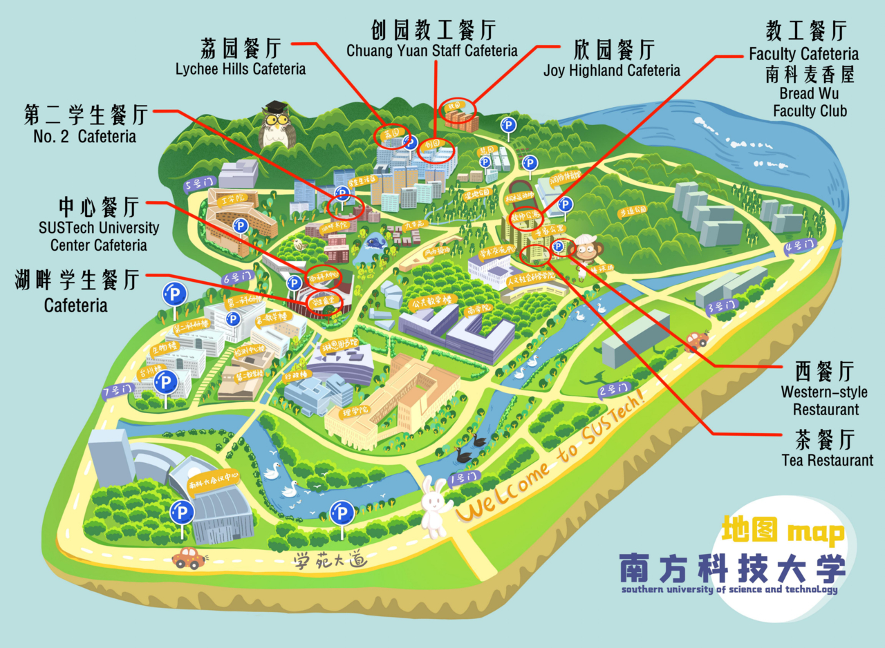

# ☕️餐饮

::: warning 信息时效

食堂档口、外包品牌、营业时间、菜品和负责人会调整。本页不再公开旧经理个人手机号，也不把往届价格或商户清单当作当前承诺。到店前请以学校邮件、餐厅门口告示和当天实际营业情况为准。

:::

## 学生餐厅

学校迎新网站公开的《新生手册》列出四处主要学生餐厅。以下内容用于快速辨认位置，具体开放楼层和档口以现场为准。

### 湖畔学生餐厅

位于第一教学楼和图书馆附近。迎新手册介绍其菜式与夜宵选择较多，一楼设有素菜窗口；当天是否供应夜宵和素食餐品，请查看现场告示。

### 荔园餐厅

位于荔园 6 栋一、二层。迎新手册列举的品类包括小炒、汤品、面食和水饺等，档口可能轮换。

### 欣园餐厅

位于欣园 5 栋一层。旧页面长期写着“待定”；学校公开资料现已列出小炒、麻辣烫、水饺、粥粉面等品类。2024 年学校公示还记录过大众菜、麻辣烫和湘式小炒等经营内容，但该合同期限已经结束，不能据此保证 2026 年具体档口仍相同。

### 第二学生餐厅

位于二期学生宿舍 10 栋一、二层。具体菜品、夜宵和开放楼层以当天安排为准；旧页面另列的 9 栋固定菜单和服务时间不再作为当前信息。

## 用餐时间

学校迎新手册给出的参考时段为早餐 7:00—9:00、中餐 11:00—13:00、晚餐 17:00—19:00、夜宵 20:30—22:30，并明确提示“仅供参考，以餐厅告示和邮件为准”。节假日、寒暑假、考试周和档口维护期间尤其可能调整。

不要根据旧攻略赶到某个档口；时间紧张时，可先查看学校邮件或向在场工作人员确认。

## 其他校内餐饮

校内还可能有教工餐厅、咖啡店、面包房、便利店和品牌档口。准入对象、地点、品牌和营业时间变化较快，旧页面所列的肯德基、星巴克、Illy Cafe、赛百味等名称不代表当前仍在原址营业，因此不再逐项维护静态名单。

## 支付、过敏与反馈

- 付款前确认价格、份数和校园卡或移动支付的扣款结果，异常时保留订单记录。
- 对食物过敏、宗教饮食或其他特殊饮食需求，应向档口当面确认原料与交叉接触风险；仅凭菜名或照片无法判断。
- 发现食物安全、明码标价或服务问题时，先保留时间、档口、订单和照片等信息，通过餐厅现场公示或学校总务渠道反馈，不在公开页面传播个人手机号。

学校官网当前列出的总务后勤部联系方式为 **0755-88018856**、`fcso@sustech.edu.cn`。

## 校外餐饮

见[周边](/surroundings/)一节。该页中的商户与折扣同样属于动态信息，出发前请重新核对。

## 公开信息来源

- [南方科技大学迎新网](https://welcome.sustech.edu.cn/)
- [南科大学生会《新生手册》（PDF）](https://welcome.sustech.edu.cn/uploads/file/HtDPJCNfvXa7i79jBE6j.pdf)
- [2024 优质外包餐厅续期公示：欣园餐厅](https://zcgl.sustech.edu.cn/sfw_cms/e?aid=133610&cid=109538&nextcid=109538&page=cms.detail)
- [南方科技大学联系我们](https://www.sustech.edu.cn/zh/contact_us.html)
