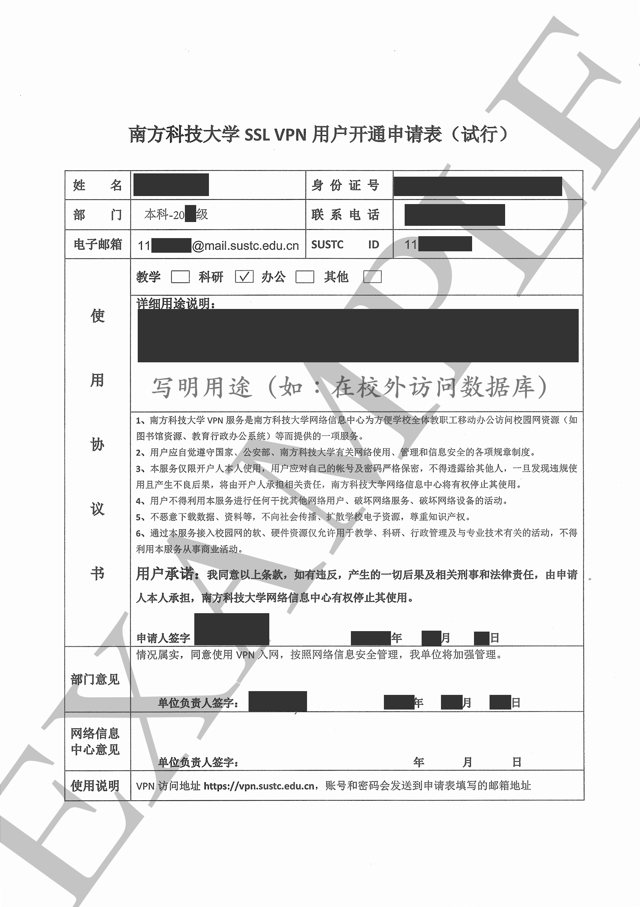

# 申请回校VPN

1. 下载申请表

- [南方科技大学 SSL VPN 用户开通申请表](https://lib.sustech.edu.cn/UserFiles/editor/1578452078845.pdf)

  

示例

2. 填写申请表

3. 提交申请表给生活导师或辅导员签字。

4. 将表格发送至 [its@sustech.edu.cn](mailto:its@sustech.edu.cn) 申请。

*提示：此VPN的用途仅限回校访问数据库，无法作为其他用途。*