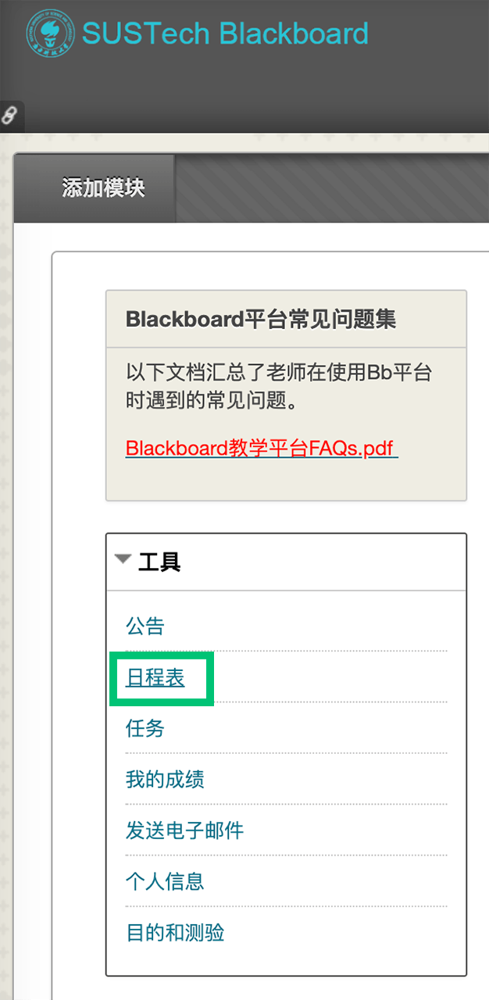
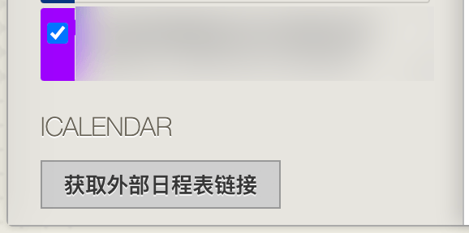

# BB | 将Blackboard中作业，DDL等日程添加到系统日历

## 什么是ICS

ICS是一种电子日历格式，它于2009年被列入RFC标准 [RFC5545: Internet Calendaring and Scheduling Core Object Specification  (iCalendar))](https://tools.ietf.org/html/rfc5545)

这种日历格式可以被方便的添加到各大系统提供的“日历”应用中。

## 从Blackboard上获取ICS链接

在Blackboard主页上，点击左侧卡片中的“**日程表**”。

在页面的左下角，可以看到一个“**获取外部日程表链接**”

点击后，Blackboard会生成一个形如 `https://bb.sustech.edu.cn/webapps/calendar/calendarFeed/12345678abcdefg/learn.ics`的URL。

## 将URL导入iCloud（适用于IOS/MacOS设备）

见[HT202361: 使用 iCloud 日历订阅](https://support.apple.com/zh-cn/HT202361)。

导入后的效果：

## 将URL导入Google Calendar

见[Google Calendar: 借助计算机程序同步您的日历](https://support.google.com/calendar/answer/37100?co=GENIE.Platform%3DDesktop&hl=zh-Hans)。

导入后的效果：

Google Calendar是许多安装有Google Play服务的Android手机的默认日历应用。

## 将URL导入国产手机系统

截止2020年6月，小米和华为手机暂未支持这一功能。