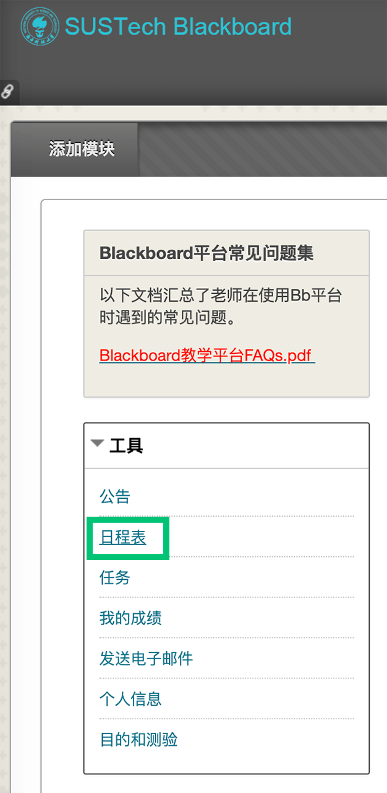
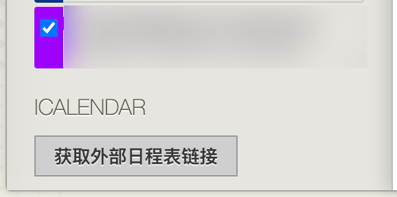
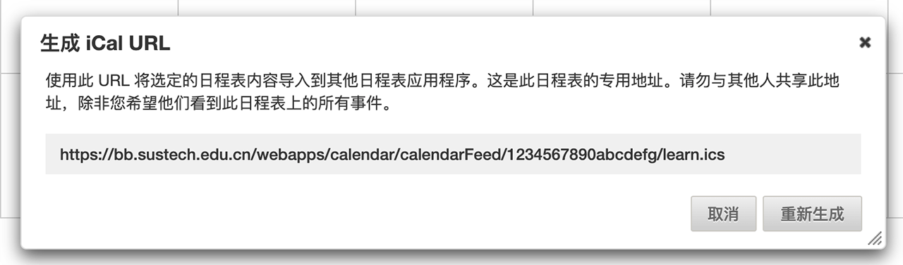
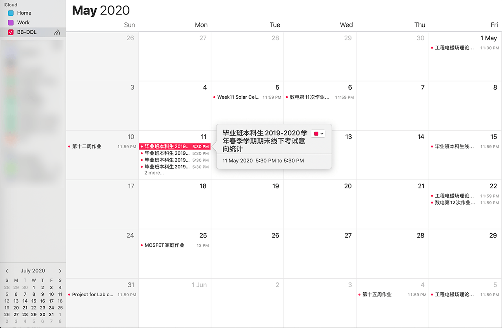
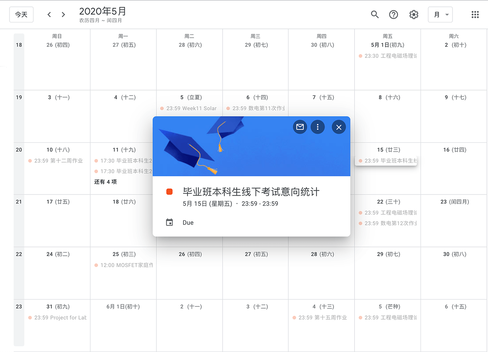

# BB | 将 Blackboard 日程订阅到系统日历

::: warning 使用边界

本页截图记录的是旧版 Blackboard 界面，菜单位置可能变化。日历订阅可能延迟刷新，也可能不包含课程中的全部要求；作业截止时间仍应以 Blackboard 课程页和教师最新通知为准。

:::

## 什么是ICS

ICS 是常见的电子日历格式，规范见 IETF 发布的 [RFC 5545：Internet Calendaring and Scheduling Core Object Specification](https://www.rfc-editor.org/rfc/rfc5545)。

订阅 ICS 地址后，兼容的日历应用可以定期获取更新；直接导入一次 `.ics` 文件则通常只是静态副本，两者不要混淆。

## 从Blackboard上获取ICS链接

在Blackboard主页上，点击左侧卡片中的“**日程表**”。

在页面的左下角，可以看到一个“**获取外部日程表链接**”

点击后，Blackboard 会生成一个形如 `https://bb.sustech.edu.cn/webapps/calendar/calendarFeed/12345678abcdefg/learn.ics` 的 URL。

::: danger 不要分享订阅地址

该地址中的随机字符串通常相当于访问凭证，得到链接的人可能无需再次登录就能读取日程标题、课程信息和截止时间。不要把真实链接发到群聊、截图、公开仓库或第三方转换网站。若怀疑已经泄露，应在 Blackboard 中重新生成或撤销链接；仅从手机日历中取消订阅不一定能让旧地址失效。

:::

## 订阅到 Apple 日历

见 Apple 当前的[使用 iCloud 日历订阅](https://support.apple.com/zh-cn/102301)。在 iPhone、iPad 或 Mac 中选择“添加订阅日历”，粘贴 Blackboard 生成的地址；不要把该日历设为公开共享。

导入后的效果：

## 订阅到 Google 日历

见 Google 的[通过网址添加日历](https://support.google.com/calendar/answer/37100?co=GENIE.Platform%3DDesktop&hl=zh-Hans)。Google 当前要求在电脑浏览器中添加新的网址订阅，之后才会同步到移动端应用。

导入后的效果：

## 订阅到其他系统

不同品牌、系统版本和日历账号对 URL 订阅的支持不同，不再沿用“截至 2020 年某品牌不支持”的结论。请在系统日历中查找“订阅日历”“从 URL 添加”或“Internet 日历”；如果没有该功能，可使用本人信任且支持订阅的日历服务，并查看其当前官方帮助。

订阅后先创建一个测试提醒，观察时区和刷新是否正常。任何重要截止时间都应另设本地提醒，并定期回到 Blackboard 核对。
