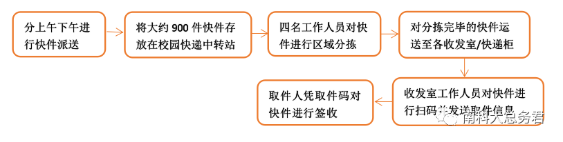

# 📦邮件与快递收发

送至南科大的快递与从南科大发出的快递，均通过南科大物业设立的邮件转运中心进行中转。

## 收发室

|                |      地址       |   电话   |
| :------------: | :-------------: | :------: |
|   荔园收发室   |   荔园8栋101    | 88015011 |
|   欣园收发室   |   欣园1栋1楼    | 88010648 |
|   书院收发室   | 湖畔书院5栋1楼  | 88010111 |
|   慧园收发室   |   慧园7栋104    | 88010640 |
| 新生宿舍收发室 | 新生宿舍13栋1楼 |          |

## 自助快递柜

| 柜体编号 |         位置         | 格口数量 |   电话   |
| :------: | :------------------: | :------: | :------: |
|   1&3    | 教师公寓栋1楼架空层  |   288    | 88010648 |
|    2     | 湖畔书院5栋1楼架空层 |    16    |          |
|    4     | 行政楼103办公室门口  |   160    |          |
|    5     | 第一科研楼1楼架空层  |   703    |          |
|    6     |   荔园9栋1楼架空层   |   352    |          |
|    7     | 学生宿舍8栋1楼架空层 |   544    |          |

::: tip 提示
快递进入快递柜/收发室后，相应的手机号将会收到短信，您也可以关注“近邻宝”公众号，通过微信取件。
:::

::: tip 提示

有时寄到13栋收发室的物品会被移至8栋的快递柜。需要注意手机收到的取件短信，短信里面有快递的具体位置。如若快递存放在快递柜，可在一天内任意时刻前往取件；如若在收发室，须在收发室开放时间前往。

:::

## 如何寄件

- 方法一：去到最近的收发室（13栋收发室），找工作人员，说明自己要寄快递，然后按照规定操作即可

- 方法二：直接在之前各种快递的app、小程序、公众号上下单，选择上门取件即可（如淘宝、唯品会退货时的上门取件）

## Q&A

### 快递柜是否支持自助寄件？

依据《中华人民共和国邮政法》《中华人民共和国反恐怖主义法》以及《邮政行业安全监督管理办法》等法律、行政法规和相关规定，所有快递一定要经过人工开箱检查后，才能实名制寄出哦！所以，寄件您可移步至就近收发室或选择网上下单预约快递公司上门取件！

### 快递显示已签收却没有收到取件通知？

有可能是面单收件人电话号码预留有误或系统录入识别号码有误，您可以随时拨打服务电话**0755-88010648**，帮您查询解答，同时还能再次秒发取件通知哦~

### 快递派送地址与收件地址不一致？

A1：如您未填写详细的收件地址，**会统一派送至荔园8栋收发室**，所以寄件时请注意填写详细的收件地址哦~

A2：快递小哥哥在分拣环节收件地址识别有误导致您的快递送错区域，请第一时间拨打服务电话0755-88010648，马上帮您做转件~

### 哪些物品是不能快递的？

《快递暂行条例》所规定的违禁品。

## 联系电话

[0755-88010648](tel:0755-88010648)

新的快递收发系统，可扫描下方二维码关注公众微信。

## 参考资料

- [探秘邮件中心·南科人气打卡点 | 新生攻略/南科新知](https://mp.weixin.qq.com/s/hgRgAmzQtWSzxcPxMQQlWg)
