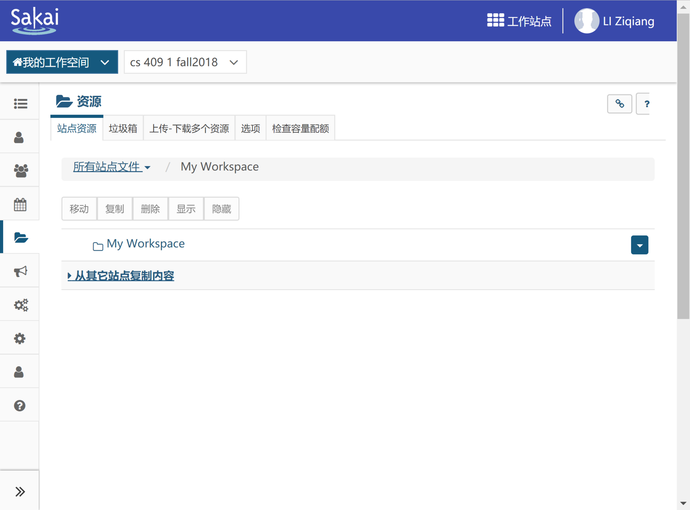

# 如何使用 Sakai 文件分享功能

众所周知，Sakai 在校园网环境下访问非常快，通过其传输 或者 分享文件也非常方便，更可免受外网访问速度的限制。

## 教程
1. 进入个人空间

    

2. 选择上传文件

    
    

3. 编辑访问权限

    
    

    访问红框内网址（`https://sakai.sustech.edu.cn/x/VgWvyf`）即可下载文件。
