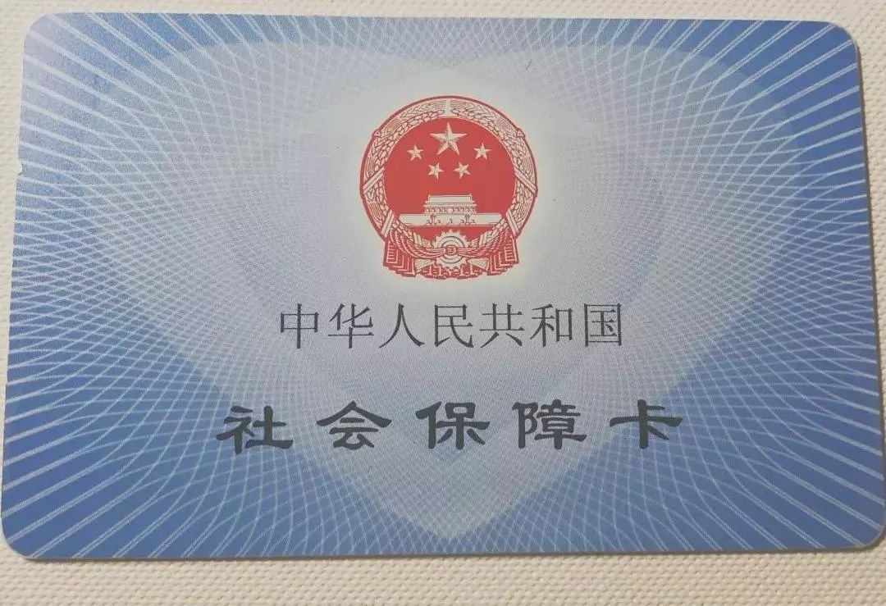
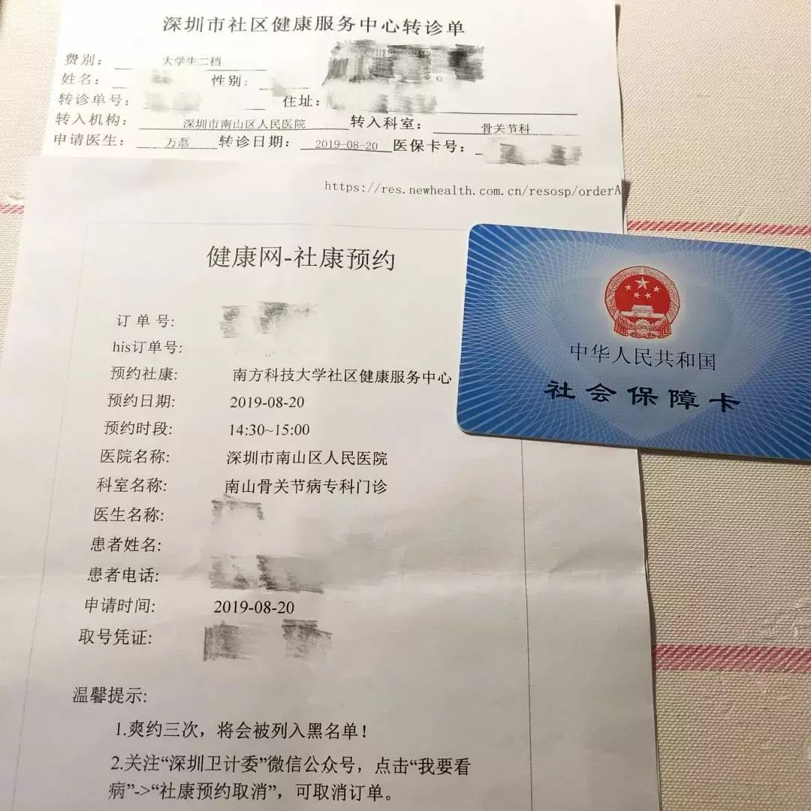
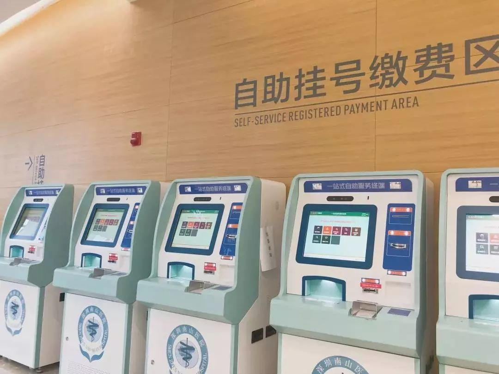
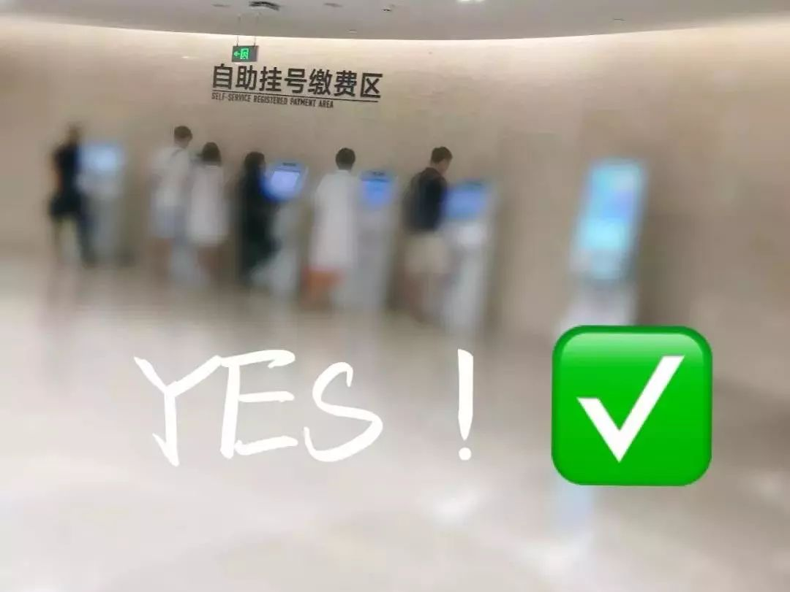
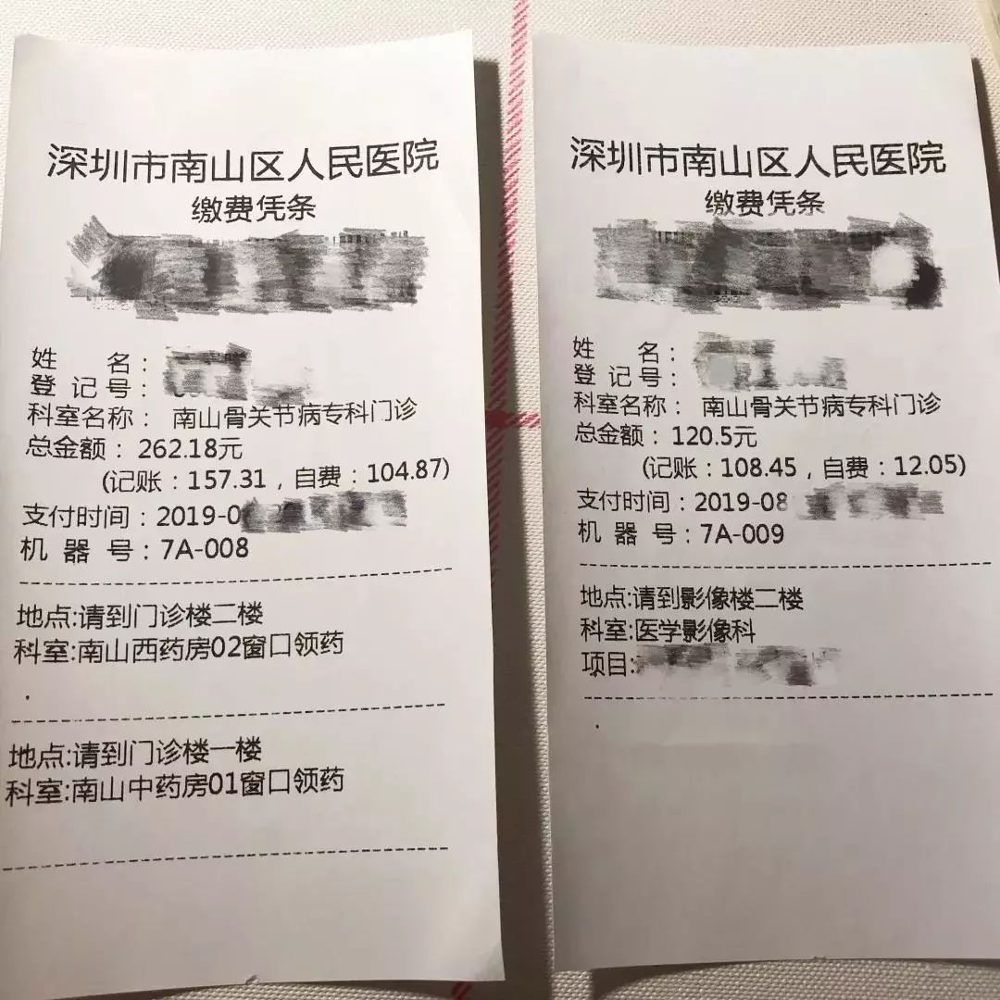

## 我应该怎样优雅就诊

原文链接：[https://mp.weixin.qq.com/s/5DRQtc-UtGaLm-rzWMODPw](https://mp.weixin.qq.com/s/5DRQtc-UtGaLm-rzWMODPw)

南科新知 2019-08-29

今天的推送有一点特殊——是校园大使和新知酱给大家讲一讲就诊那些事。

刚刚入学的新生可能会印象深刻，在报到时需要的照片，除了之前的校园卡制卡工作需要，也会在你的社会保障卡和新居民身份证上出现（if you 选择迁户口）。

今天，我们就来看看这个神秘的小卡片，到底应该怎么用。

## Step 1

无论是感冒发烧，还是其他身体不适地症状，都要第一时间拿着**社保卡**（全称：“中华人民共和国社会保障卡”。没错就是下图酱紫的）前往校内社康中心挂号诊断！

### 注意事项

1.社康中心的工作时间为

  工作日的**8：30—17：00**（中午不休息)

  联系电话为**88010120**

如果在其他时间段出现不适急需就医可联系校内24小时住校医生，请拨打电话**18218715551**（答应小编，把这个号码存到通讯录好吗！！！）

2.社保卡不是就诊必需，非紧急情况下建议大家一！定！拿！上！社！保！卡！（留下了贫穷的泪水）因为拿上社保卡就诊可以用社保报销很大一部分诊疗费，可以省下好多好多money！

如果很幸运您的身体不适在社康中心就已经解决了，那么你可以直接跳到本文最后。

但------是------，**以下内容建议阅读并收藏。**

## Step 2

如果遇上社康中心医生未能解决的问题，这时候医生也就会为您办理**转诊**啦！简言之，就是转到其他医院，社康中心的医生会与你商量后帮你挂号（哪个时间段的哪个医生均由你们商量而定）。

**注意**：每一个社康中心对应一个定点医院，南科大校内的社康中心对应的定点医院为南山区人民医院，所以在南科大社康转诊只能转到南山区人民医院（也叫深圳市第六人民医院）。

社康中心医生为您办理转诊后，你会拿到以下资料，接下来，你应该拿着社保卡+社康预约打印单+盖章后的转诊单（在社康中心收费处医生盖章）在指定时间前往转诊的医院啦！

嘿嘿嘿，就是他们仨~~

欲知转诊后事，请听......

小编接着啰嗦.....

*“健康的身体，*

*永远是你拼命争取那无数个零前面的一。”*

## Step 3

**时间安排：**

亲亲你好，小编这边建议在预约的就诊时间前**提前半小时**到达医院办相关手续排号比较合理。比如：我预约的就诊时间是14：30—15：00，那么我最好在14；：0到达医院，取号排队。别问为什么，问就是.....因为人真的很多，要等很久啊呜呜呜呜┭┮﹏┭┮

**交通：**

普通版：步行至塘朗站，乘坐**5号线**，在宝安中心转地铁**1号线**，在桃园站C口出，步行200m就到啦，费用6元。

豪华版:一键（滴滴）打车，方便省事，就是费用多了那么一丢丢，大约50—60元。

(1).到达后，请一键步行至门诊楼一楼大厅，找到下图自助办理机器，刷社保卡/身份证均可，然后取到下图的挂号指引单；

(2).确认你所就诊科室的就诊地址，挂号指引单上面可能写的不清楚，建议在一楼大厅咨询处向工作人员咨询清楚在几楼。

你看这个指引单它有bug（哼(￢︿̫̿￢☆)）就诊地址都没写清楚！

## Step 4

就诊完毕，如果医生开出处方，那么你的南山医院一日游**还没有结束**！接着看下去吧！

一、医生开出药房

二、开检查项目（如拍X光、验血等）

无论开出哪一种处方，都需要先缴费才能进入下一步噢，温馨提示到达下图所示自助缴费机缴费（支持微信和支付宝两种付款方式），因为人工收费处排队的人会很多（如果你只有现金支付的话那还是乖乖排队吧）。

缴费完毕，会有下图所示的缴费凭条，那么此时，根据凭条上的信息，前往相应地点完成下一步即可！

### 温馨提示

1.像是拍X光片一类的检查通常还会需要拿着凭条到相应科室排队然后**等待叫号**，所以一定要找准地方排好队然后静静地等待噢！

2.药房窗口取药时医生会要求拿出医生开的处方那张单子，并且会在您取药后将处方收走，所以如有存档需要请提前拍照。

3.拍X光片完成后医生一般会说要**等1个小时**才能拿结果（天呐，怎么可以这么久）。但是小编自己的经历是这样的：约16：00才拍完X光片，还要把结果拿给医生诊断，如果等一个小时之后拿结果医生都已经下班了呀！于是我来到我就诊时的地点，向分诊台的医生说明了情况，小姐姐超温柔地告诉我说等半小时后去找医生看看，医生或许已经可以在电脑上看到结果了。于是，我让小姐姐先帮我排号（复诊也需要排号）大概二十多分钟后，就到我了，我想医生说明了情况，医生在电脑上果然看到了结果然后给出了相应诊断、病历。

今天想出这样一篇推送，是想告诉大家，离开父母的庇护，我们才更要好好的生活，学会看病，让自己更加健康阳光的面对未来！经验告诉我们，遇到问题别着急，多向人请教，一定有办法解决的耶~

**------END------**

*南科新知 学生新闻社*

*校园大使*

*文字 / 太阳豆豆 赵滢*

*编辑 / 赵滢*

*设计 / 新知酱*

*审核 / 孙汇文 C姐姐*

::: warning 版权
© 南科新知，保留所有权利。
:::
