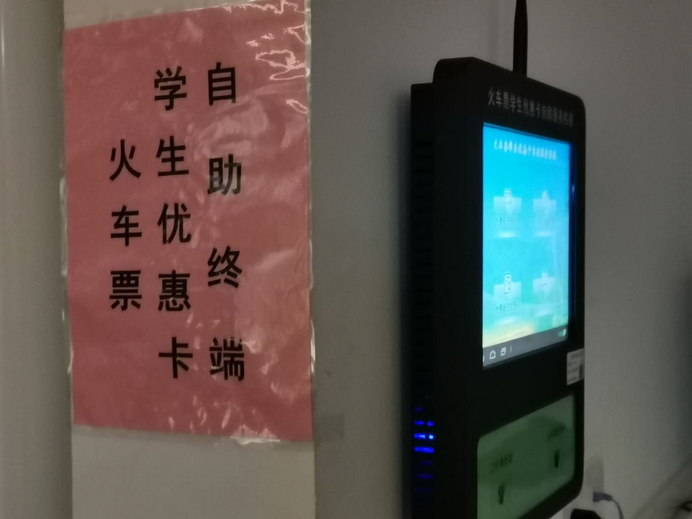
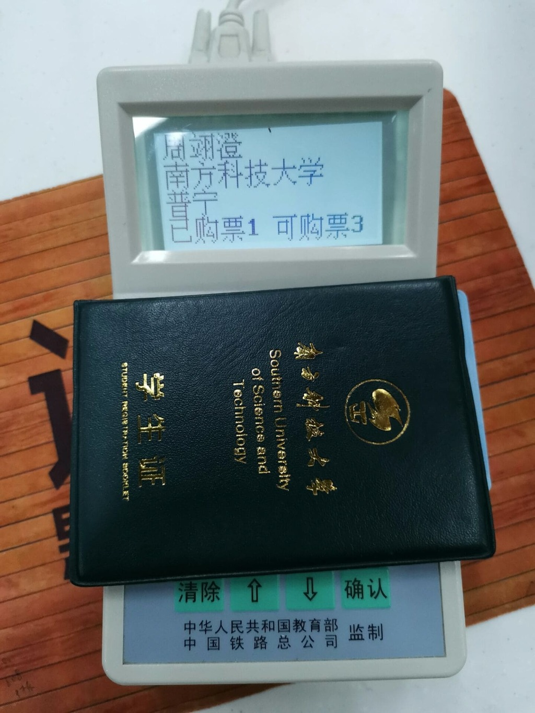
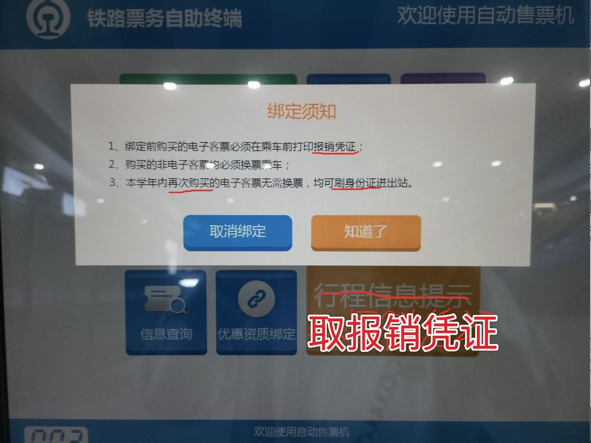
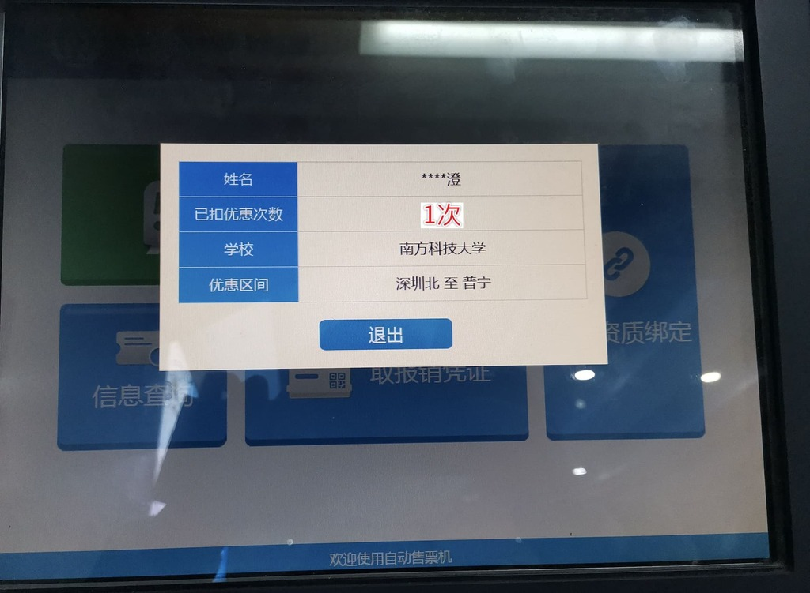

# 火车票学生优惠使用指南

*由 周翊澄 贡献*

本指南包含对火车票学生优惠的写卡，充磁，验证，购票，进站等操作的说明。

## 写卡

第一次使用学生优惠的同学需要将**身份证**信息写入优惠卡中（优惠卡是**学生证**中的一页）（图1）

图1（图源南科大学生事务中心）

## 充磁

学生优惠每学年只能使用4次，因此每年**寒假**前需要到书院1栋一楼**学生事务中心**进行充磁（大一新生无需充磁）
充磁机器有两种，一种是自助终端机（图2），一种是小机器（图3）

图2

图3

自助终端机充磁：选择**购票次数充值**（图4），放置学生证充磁。高年级或研究生同学如遇到图5情况或充磁后优惠次数不等于4次（图6），请使用小机器充磁。

图4

图5

图6

小机器充磁：将学生证放置在小机器上（图7），按**确认**即可。（如找不到小机器请咨询前台学生助理）

图7

## 验证

因为每年学生优惠资质会自动解绑，所以每学年**首次**使用学生优惠需携带**身份证**和**学生证**到**深圳北站**自助售票机或售票窗口验证学生优惠资质并且取出报销凭证，走人工验证通道进站。（图8）

图8

火车站部分机器无法识别学生证，建议使用自动售票处2和自动售票处3的小机器（图9）验证学生**优惠资质**并取出**报销凭证**。

图9

操作方法（图10 ）：选择**优惠资质绑定**，将学生证身份证依次放置在证件识别区（图11）。选择**取报销凭证**，将身份证放置在证件识别区。选择**信息查询**将身份证放置在证件识别区可查询已扣优惠次数（图12）。

图10

图11

图12

## 购票

学生优惠的使用时间为每学年的暑假6月1日至9月30日、寒假12月1日至3月31日。
学生票普速旅客列车票价按相应客票和附加票票价的50%计算，动车组列车二等座按票价的75%计算。
购票（以12306 App为例）添加乘车人时将旅客类型设置为学生即可。（图13）

图13

## 进站

每学年首次乘车前需取出**报销凭证**并走人工验证通道（图14）进站，之后三次可直接刷**身份证**进站。（乘车时请随身携带**学生证**以备工作人员查验)

图14

## 后言

铁路部门全面实施电子客票对于新生使用学生优惠可能造成一定的困惑，希望本文能给各位同学提供些许帮助。一切以实际情况为准，如遇到困难及时寻求人工帮助，不要和机器作斗争。请大家注意出行安全，保管好重要证件，做好疫情防护，遇到紧急情况可拨打110。本文仓促写成，如有笔误请联系476084612（QQ）。

参考资料：
* [中国铁路12306-出行指南-常见问题-学生](https://kyfw.12306.cn/otn/gonggao/student.html)
* [转发！学生票优惠次数、票价怎么算？](https://mp.weixin.qq.com/s/nl3FuXB1HKKLJjc_NuJPgg)
