# 火车票学生优惠使用指南

::: tip 信息核对

以下现行规则于 2026 年 8 月 31 日根据[中国铁路 12306 学生票常见问题](https://kyfw.12306.cn/otn/gonggao/student.html)核对。铁路规则可能调整，购票前请以 12306 的最新公告和订单页面为准。
:::

## 现行规则速览

### 适用条件和优惠次数

- 家庭居住地和学校所在地不在同一城市的符合条件学生，可以购买家庭居住地至院校（实习地点）所在地之间的学生优惠票。
- 每学年（10 月 1 日至次年 9 月 30 日）可购买 4 次单程学生优惠票。优惠次数仅在当学年有效，不能结转至下一学年。
- 每学年乘车前，应在铁路 12306 在线完成学生优惠资质核验，或持居民身份证和火车票学生优惠卡到车站指定窗口、自动售票机办理一次核验。乘车时仍应随身携带学生证，以备工作人员核验。
- 在线核验仅核验在校学生身份，优惠乘车区间仍以学生证记载为准，并由站车在乘车过程中核验。请确保在线填写的区间与学生证一致，否则可能需要补收票价差额。

### 可购买的席别和票价

- 普速旅客列车可购买硬座、硬卧学生优惠票。硬座客票及相应附加票按公布票价的 50% 计算；购买硬卧时，卧铺部分按全价计算。
- 动车组列车可购买二等座、二等包座、多功能座、一等座和动车组卧铺等席别的学生优惠票。
- 动车组学生优惠票按对应席别全价执行票价的 75% 计算。全价执行票价不低于公布票价 40% 时，学生优惠票最低为公布票价的 40%；全价执行票价低于公布票价 40% 时，学生优惠票按全价执行票价计算。

### 新生、毕业生购票和进站

新生可使用本人身份信息注册铁路 12306 账户，并将优惠类型设为“学生”；随后在铁路 12306 App 的“我的—学生优惠资质核验专区”填写学校、家庭所在地和预计毕业年份等信息。新生凭录取通知书，可在当年开学前购买 1 次从家庭居住地到学校所在地的学生优惠票。

线上购票后，新生可持身份证和录取通知书到车站窗口办理核验，再刷身份证进站；如未办理线下核验，则应携带录取通知书和购票时使用的有效身份证件，从人工检票口进站。

毕业生凭加盖院校公章的学校书面证明，可在当年购买 1 次从学校所在地出发的学生优惠票。乘车时应携带该证明和购票时使用的有效身份证件，从人工检票口进站。

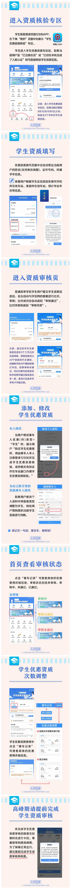

### 联程购票

优惠区间内没有直达列车，或其中一段需要乘坐动车组列车时，可以分段购买学生优惠票。联程车票应按相对近径路或合理径路购买；各段列车开车时间在 5 天以内的，扣减 1 次优惠乘车次数。超过优惠区间的部分不能购买学生优惠票。

## 2022 年之前的验证方式（历史存档）

::: warning

以下流程和票价规则已经过时，仅为保留原贡献记录，不应作为当前购票依据。
:::

> *由 周翊澄 贡献*
>
> 本指南包含对火车票学生优惠的写卡，充磁，验证，购票，进站等操作的说明。
>
> 2022春节火车票特别优惠活动（广东学联提供）：[高校学生补贴-减10元](https://mp.weixin.qq.com/s/mv_iz01Za4RWPq8qvjnclA)
>
> ## 写卡
>
> 第一次使用学生优惠的同学需要将**身份证**信息写入优惠卡中（优惠卡是**学生证**中的一页）（图1）
>
> 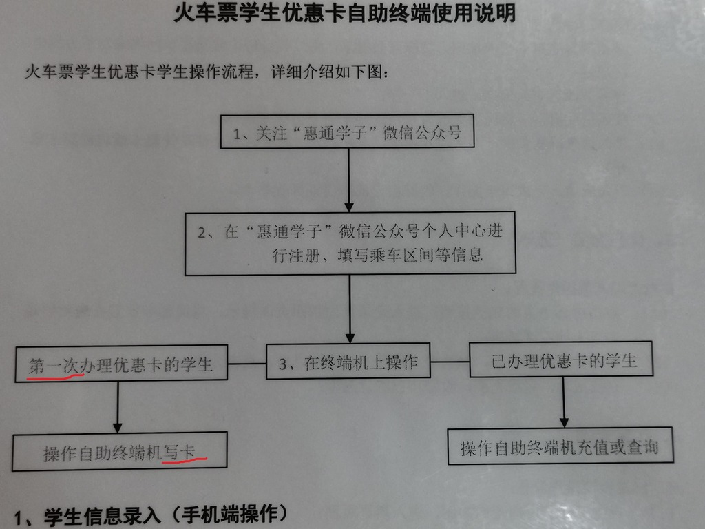
> 图1（图源南科大学生事务中心）
>
> ## 充磁
>
> 学生优惠每学年只能使用4次，因此每年**寒假**前需要到南科大中心二层**学生事务中心**进行充磁（大一新生无需充磁）
> 充磁机器有两种，放在事务中心前台桌上。建议直接咨询前台学生助理，说学生证充磁即可。
>
> 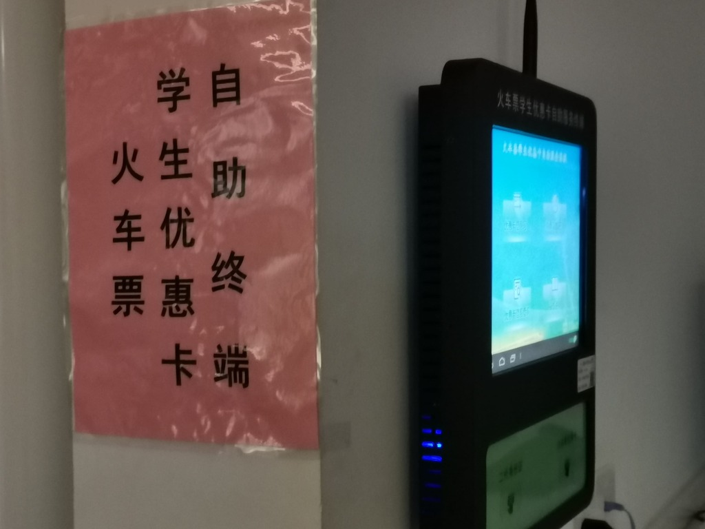
> 图2
>
> 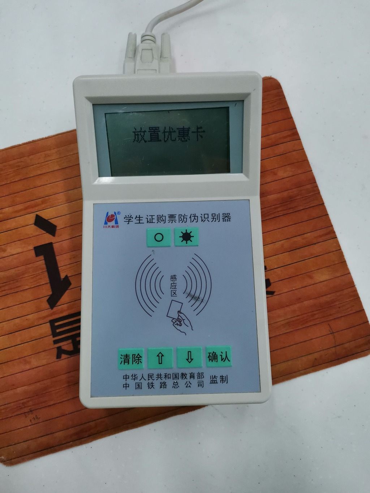
> 图3
>
> 自助终端机充磁：选择**购票次数充值**（图4），放置学生证充磁。高年级或研究生同学如遇到图5情况或充磁后优惠次数不等于4次（图6），请使用小机器充磁。
>
> 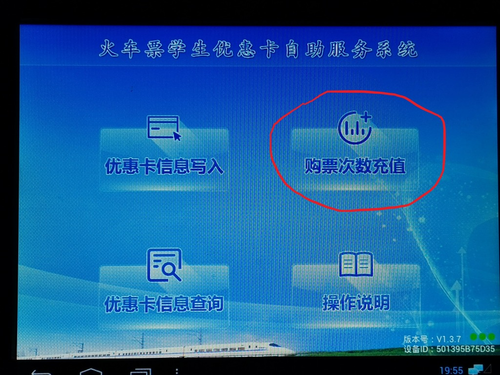
> 图4
>
> 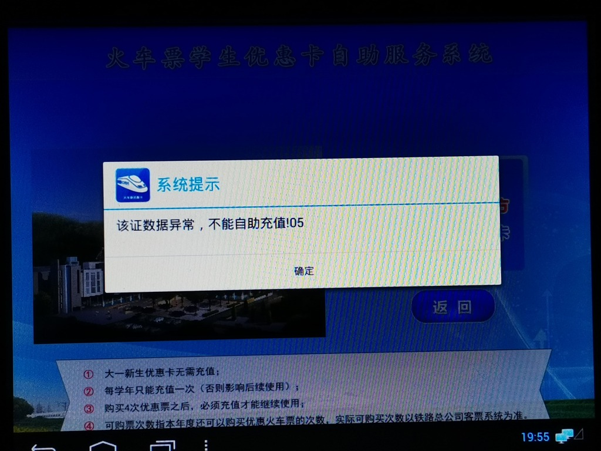
> 图5
>
> 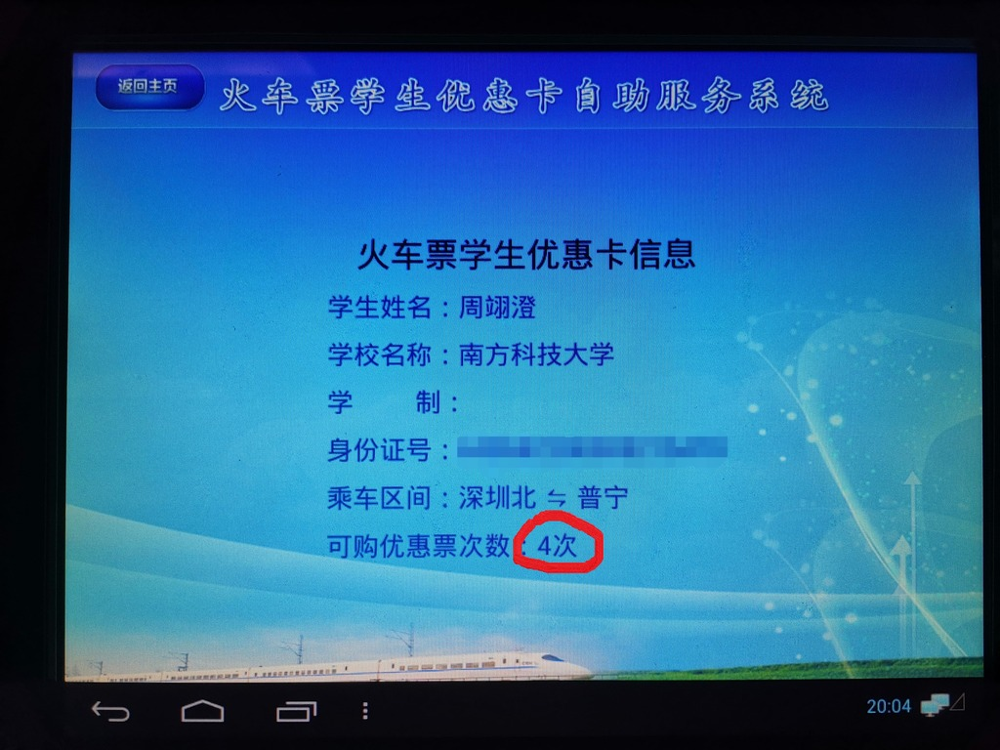
> 图6
>
> 小机器充磁：将学生证放置在小机器上（图7），按**确认**即可。（如找不到小机器请咨询前台学生助理）
>
> 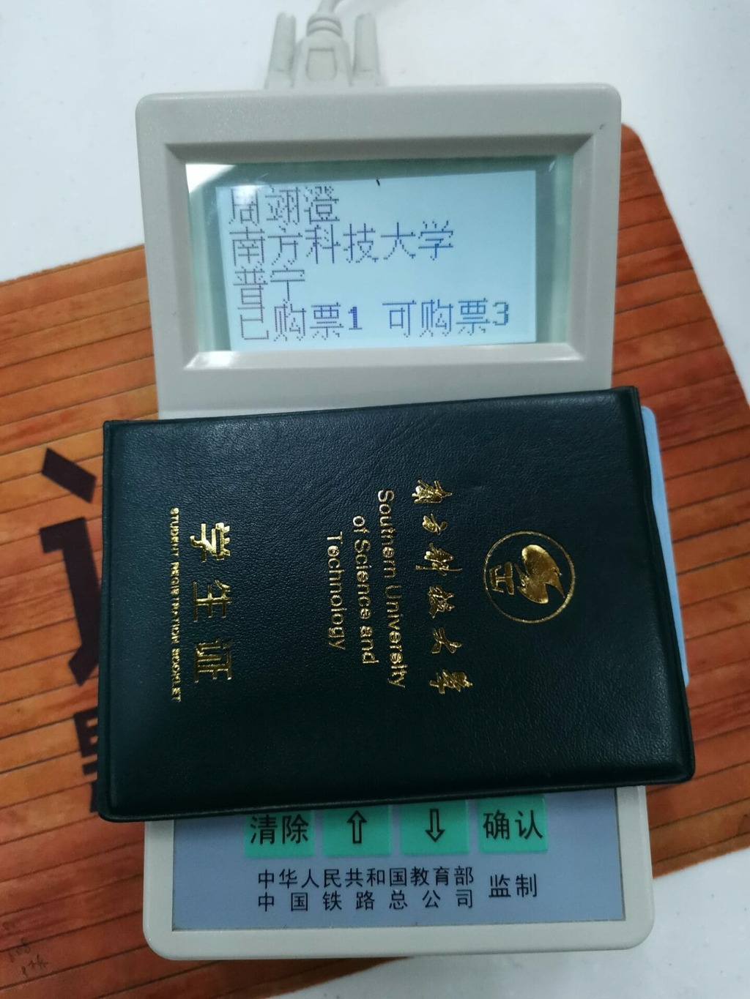
> 图7
>
> ## 验证
>
> > 学生优惠资质可以登录铁路12306APP***在线核验***了，线下核验渠道仍保留！
>
> 因为每年学生优惠资质会自动解绑，所以每学年**首次**使用学生优惠需携带**身份证**和**学生证**到**深圳北站**自助售票机或售票窗口验证学生优惠资质并且取出报销凭证，走人工验证通道进站。（图8）
>
> 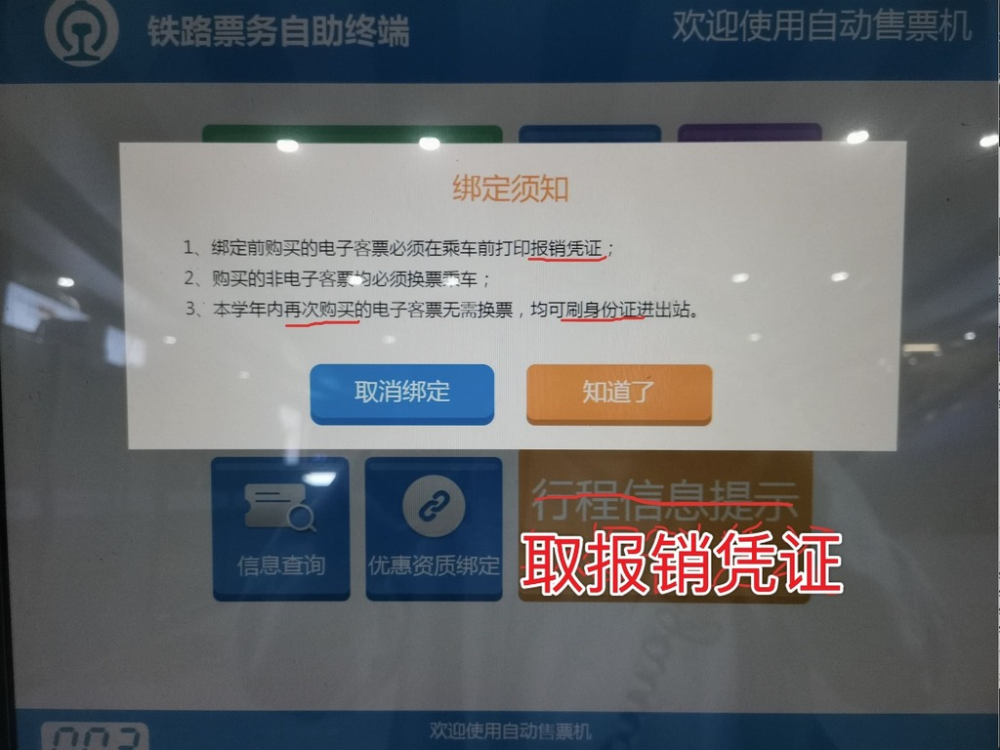
> 图8
>
> 火车站部分机器无法识别学生证，建议使用自动售票处2和自动售票处3的小机器（图9）验证学生**优惠资质**并取出**报销凭证**。
>
> 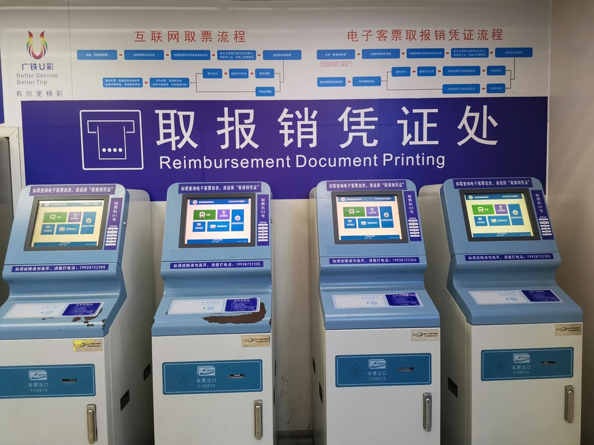
> 图9
>
> 操作方法（图10 ）：选择**优惠资质绑定**，将学生证身份证依次放置在证件识别区（图11）。选择**取报销凭证**，将身份证放置在证件识别区。选择**信息查询**将身份证放置在证件识别区可查询已扣优惠次数（图12）。
>
> 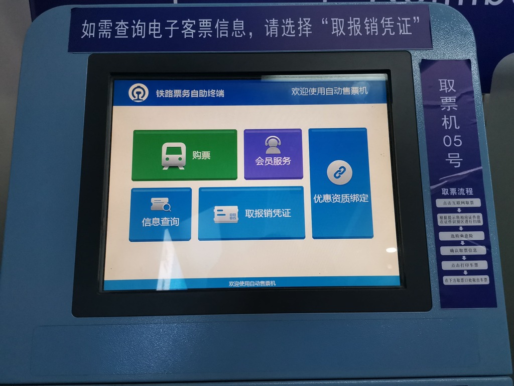
> 图10
>
> 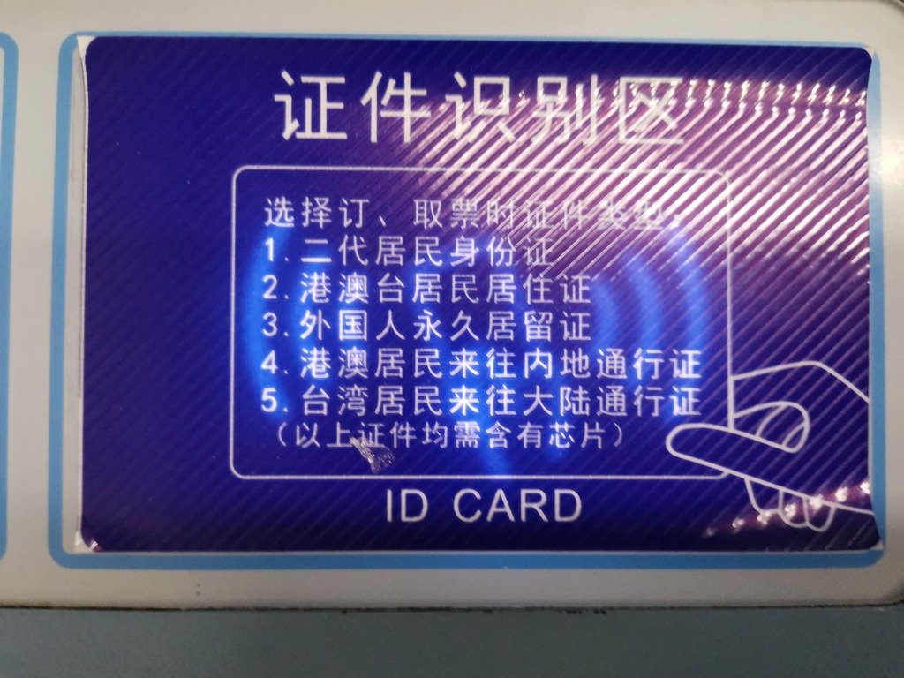
> 图11
>
> 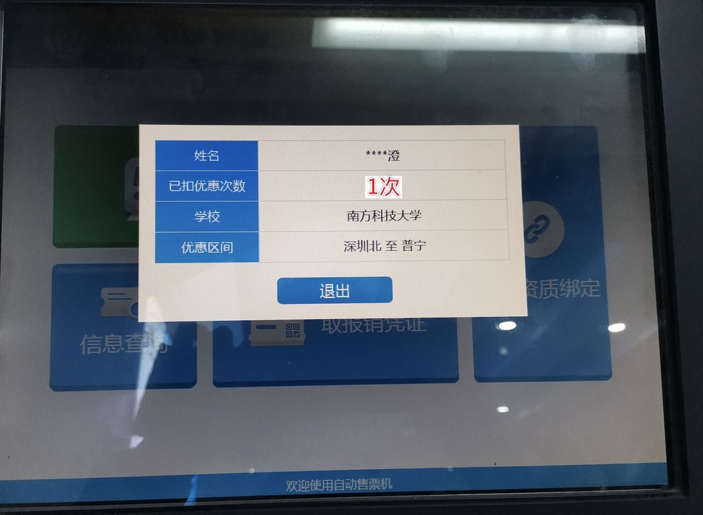
> 图12
>
> ## 购票
>
> 疫情后，学生票一年四次，全年可买，以每年10月1日为计数界限。
> * 普速列车学生票，硬座为半价，硬卧为(硬卧原价-0.5✖硬座原价)
> * 动车组列车二等座按**公布票价**的75%计算。某些公布票价很高，而实际票价较低的动车组列车，如果实际票价已经低于公布票价的75%，此时二等座学生票仍可购买，但是将不会获得优惠。
>
> 购票（以12306 App为例）添加乘车人时将旅客类型设置为学生即可。（图13）
>
> 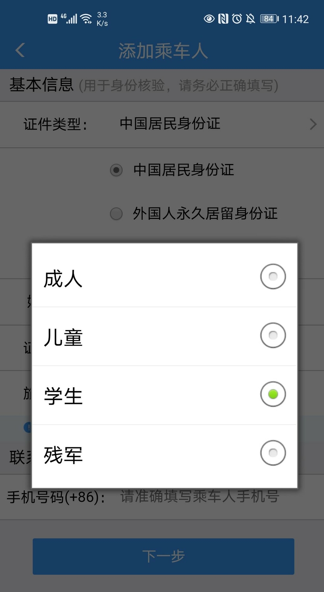
> 图13
>
> ## 接续换乘
>
> 如果从深圳到家没有直达的火车，可以在中途车站转乘其他车次列车。这种操作叫做**接续换乘**。
>
> 学生票接续换乘时请注意以下事项：
> 1. 请预留足够的换乘时间，包括考虑列车可能的**晚点**。
> 2. 换乘可以是不同的车站，但是必须在同一个城市。
> 3. 一次学生票机会（一年四次）最多购买三段区间，也就是最多进行两次换乘。前后段都买学生票但是中段不买学生票，会被计作两次学生票。但是只买中间一段区间的学生票也是允许的。
> 4. 换乘时间不得超过72小时，否则也会被计作两次。
> 5. 理论上只能买最短路程，或直达车经过的线路。实际操作中，只要不是明显的绕路都可以出学生票。
>
>
> ## 进站
>
> * 如果在绑定资质前就购买了车票，乘车前需取出**报销凭证**并走人工验证通道（图14）进站，之后三次可直接刷**身份证**进站。（乘车时请随身携带**学生证**以备工作人员查验)
> * 如果购票前已经绑定了学生资质，则不需要取报销凭证，可**直接刷身份证**进站乘车。
>
> 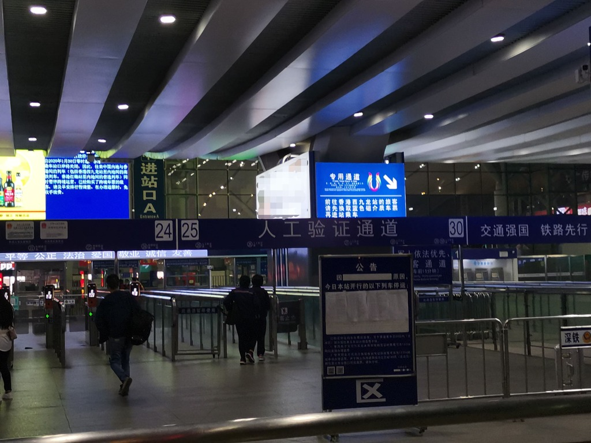
> 图14
>
> ## 后言
>
> 铁路部门全面实施电子客票对于新生使用学生优惠可能造成一定的困惑，希望本文能给各位同学提供些许帮助。一切以实际情况为准，如遇到困难及时寻求人工帮助，不要和机器作斗争。请大家注意出行安全，保管好重要证件，遇到紧急情况可拨打 110。原文个人联系方式已移除。
>
> 南科大交通协会（筹）的成员曾更正本文的部分内容。原文中的历史 QQ 群号未核验当前用途和管理者身份，已移除。
>
> 参考资料：
> * [中国铁路12306-出行指南-常见问题-学生](https://kyfw.12306.cn/otn/gonggao/student.html)
> * [转发！学生票优惠次数、票价怎么算？](https://mp.weixin.qq.com/s/nl3FuXB1HKKLJjc_NuJPgg)
