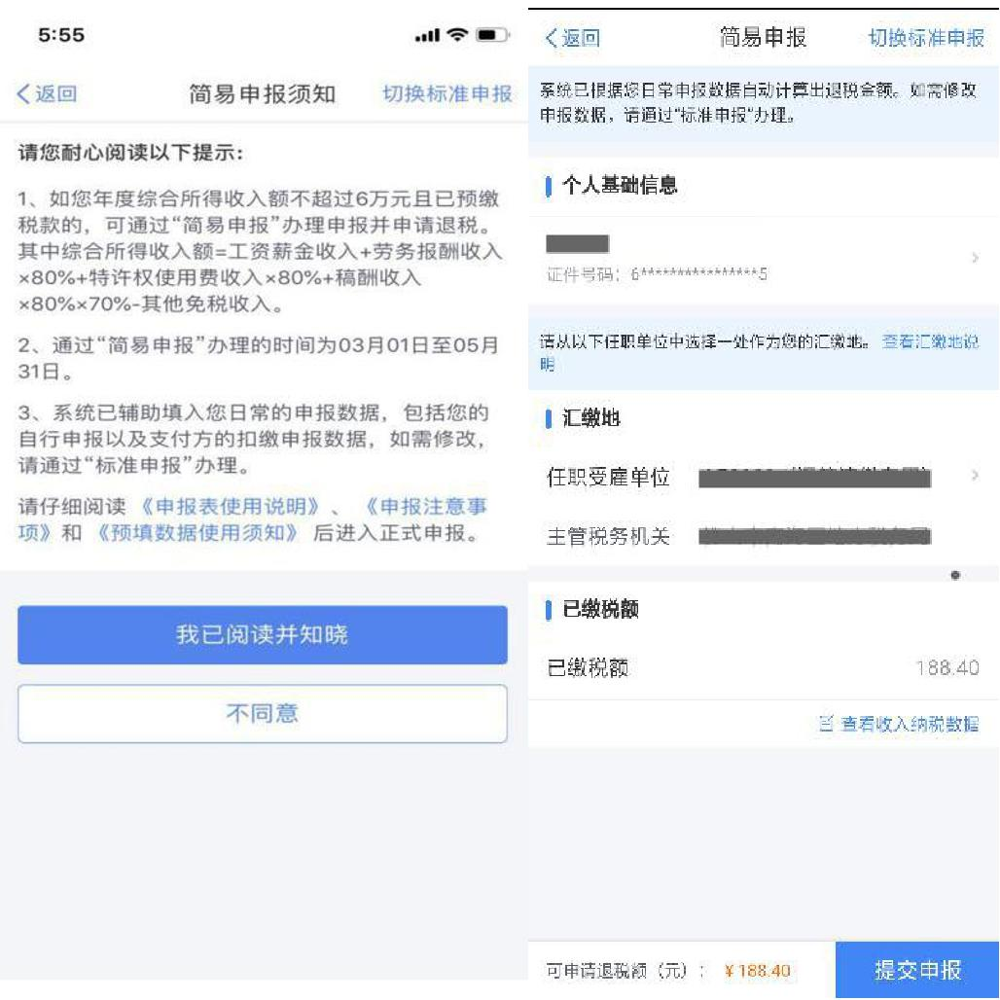
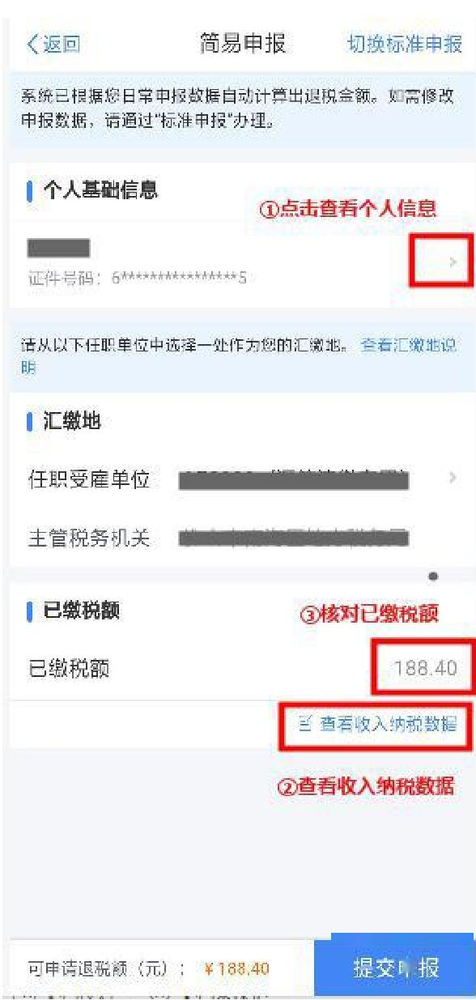
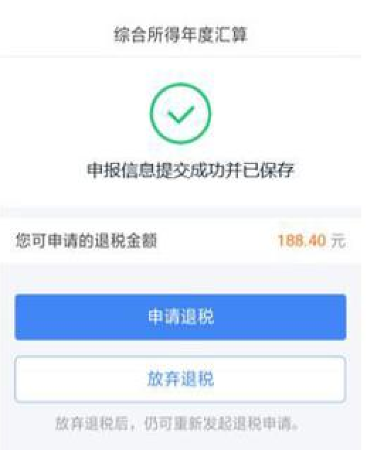
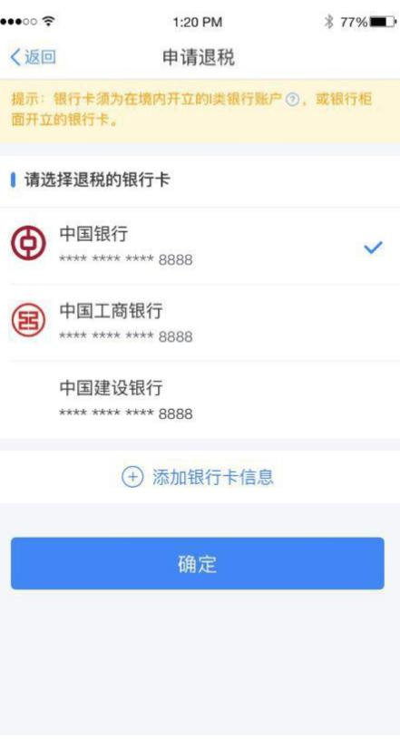
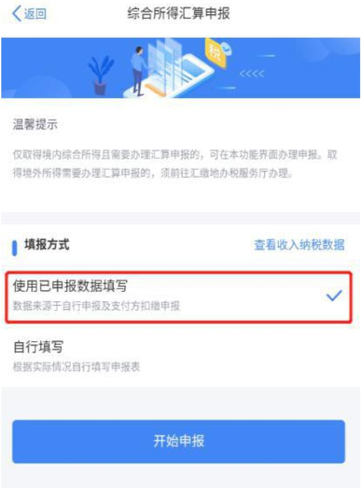
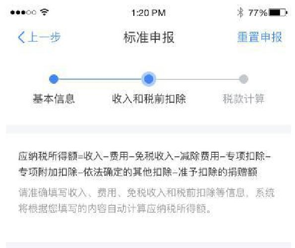
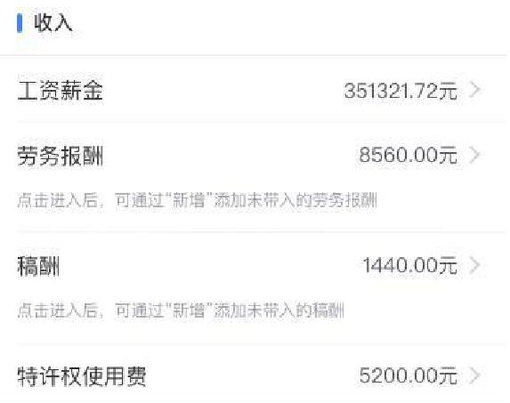
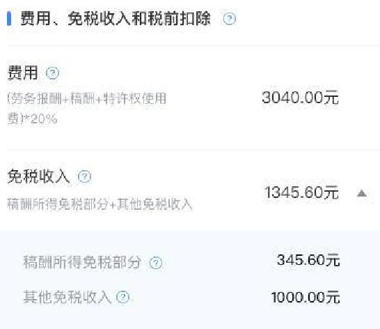
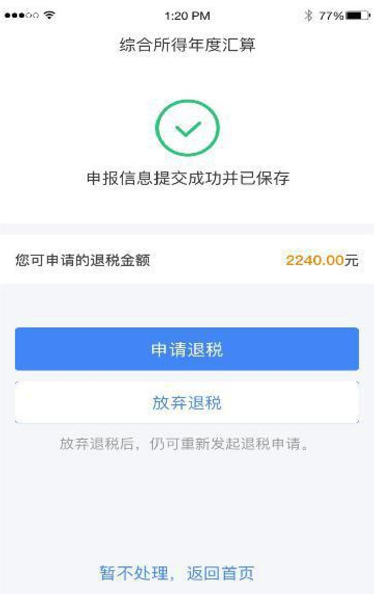

# 如何申报退税？-- 年度个人所得税年度汇算

## TL.DR 太长不读

汇算指的是清算上一年度预缴税款，多退少补。**上年度薪金收入不超过6万元，即可免征个人所得税，如已交税款都可以退回。**

时间窗口：每年4月-6月汇算上一年度。

汇算方式：

1. “个人所得税” 手机APP端
2. 网页WEB端 <https://etax.chinatax.gov.cn/>

## 导读

从4月1日起，全国各地已经全面开放汇算清缴办理渠道，包括“个人所得税”手机APP端和网页WEB端办理通道。年收入不超过12万可免个税汇算清缴。

**学生该如何办理呢？这份小贴士请收好。**

我们所说的“学生党”，主要是指在校的大学生、研究生、博士生。一般来说，“学生党”的收入主要有两种，一种是奖学金、助学金、学校的研究生补助等，此类不计入汇算清缴；另外一种是导师给予发放的津贴补助、实习单位发放的实习工资、兼职所得报酬等。超过800元即产生税额。

举个例子，导师每月发津贴1200元，1200-800=400，超出的400按照20%缴纳税款为80元，所以你实际到手为1200-80=1120元。每月工资越多，扣的税越多。

## 学生党办理汇算清缴情况

1. 2019年已交税额大于应缴税额，需要申请退税的同学。由于三助津贴是按劳务报酬计税。在年度汇算的时候，劳务报酬需要并入综合所得计税，多退少补。**全年应发税前劳务报酬低于7万5的同学，是不需要交税的，已交税款都可以退回。超过7.5万的同学，按综合所得重新汇算计税后，已交税款大于应缴税额的，可以申请退回多交部分税款。**

2. 2019年从多个单位取得收入，并且已交税额小于应缴税额，需要补税的同学。

同学们可在个税APP-服务-收入纳税明细查询中查询自己2019年收入合计。

### 需申请退税情况举例：

A同学每月收到3500元的助研津贴，依据税法，按劳务报酬计税。

劳务报酬所得适用的税率表：

| **级数** | **应税收入**               | **税率（%）** | **速算扣除数** |
| -------- | -------------------------- | ------------- | -------------- |
| 1        | 不超过20000元的            | 20            | 0              |
| 2        | 超过20000元至50000元的部分 | 30            | 2000           |
| 3        | 超过50000元的部分          | 40            | 7000           |

应税收入为：每次收入不超过四千元的，按收入额减去八百元计算；每次收入四千元以上的，按收入额的百分之八十计算。

税额=应税收入×税率-速算扣除数

（1）每月扣税（3500-800）*20%=540元。

汇算清缴时。工薪所得、劳务报酬所得等纳入综合所得，按年合并计算个税。**基本减除费用为6万/年。**

综合所得适用的税率表：

| 级数 | 全年应税收入                   | 税率 (%) | 速算扣除数 |
| ---- | ------------------------------ | -------- | ----------- |
| 1    | 不超过36000元的部分            | 3        | 0           |
| 2    | 超过36000元至 144000 元的部分  | 10       | 2520        |
| 3    | 超过144000元至 300000 元的部分 | 20       | 16920       |
| 4    | 超过300000元至 420000 元的部分 | 25       | 31920       |
| 5    | 超过420000元至 660000 元的部分 | 30       | 52920       |
| 6    | 超过660000元至 960000 元的部分 | 35       | 85920       |
| 7    | 超过960000元的部 分            | 45       | 181920      |

**（2）A同学全年应税收入=3500\*12\*80% - 6万，小于0，所以无需缴纳个人所得税。全年已交税额540\*12=6480元都可以退至“个税APP”所填银行卡。**

## 申报准备

1. 同学们可以先下载**个税APP**，应用名为“个人所得税”，下载前请先确认该应用来源于国家税务总局。

2. 进行注册。

3. 填写银行卡号。

## 简易申报与标准申报的操作流程

**使用手机 APP 端申报**，同学们可以从以下两个入口进入年度汇算：

1、从首页的【常用业务】区块的【综合所得年度汇算】进入；

2、从【快捷入口】-【我要办税】下或底部【办税】 菜单进入后，点击在【税费申报】下 的【综合所得年度汇算】。

### 一、简易申报

2019 年取得的综合所得收入额未超过 6 万元且已缴税款的同学，可通过简易申报申请退税。

**1、确认申报表信息**

核对个人基础信息、汇缴地、查看收入明细数据，确认已缴税额。

**2、申请退税**

在申报提交完成页面上，**选择【申请退税】**。

进入银行卡选择界面，会自动带出添加好的银行卡。您也可以点击【**添加银行卡信息**】。

选择银行卡后提交退税申请，可以看到退税申请进度。

### 二、标准申报

2019年度综合所得年收入额超过6万元的同学，可以在3月1日至6月30日内，通过标准申报办理年度汇算。进入申报界面，选择【使用已申报数据填写】：

1、确认基本信息基本信息页面支持修改“电子邮箱、联系地址”信息，**选择本次申报的汇缴地**。（与简易申报截图类似）

2、生成和确认申报表信息系统将自动归集您在纳税年度的收入纳税数据[工资薪金、劳务报酬、特许权使用费所得]，并直接预填至相应申报栏次。

3、修改申报表信息若您需要修改已预填的申报数据，可修改对应明细表或附表。

4、缴纳税款或申请退税

（1）缴税

若您存在应补税额但不符合免于申报，可点击【**立即缴税**】进入缴税。

（2）申请退税

若您存在多缴税款，可点击【**申请退税**】。

进入银行卡选择界面，会自动带出添加好的银行卡。可以点击【**添加银行卡信息**】。操作与简易申报一致。

## 特别提醒

1. 如点击【综合所得年度汇算】后，出现“该功能将视疫情形势变化及时开通”， 可能是由于 APP 没有登录，在个人中心登录即可。

2. 若进入申报时出现“业务处理失败：当前纳税人不存在户籍所在地和经常居 住地”，是由于个人信息未填完整，在个人中心-个人信息补充完整信息即可。

3. 个税 APP 里的“申诉”功能不是办理退税的功能，是申诉不存在此笔收入。不要随意点击申诉按钮。已有同学误点申诉造成无法进行退税的情况。

