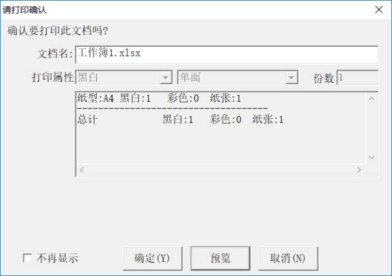
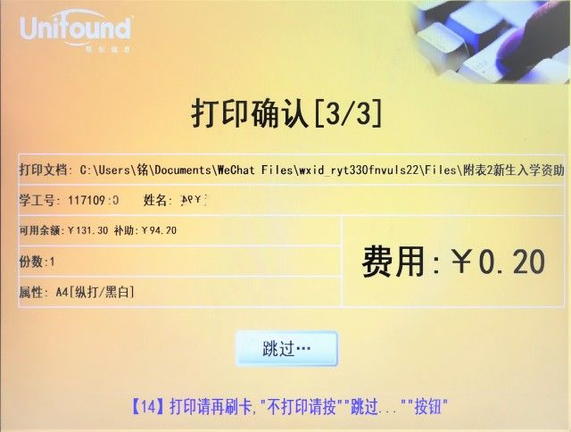
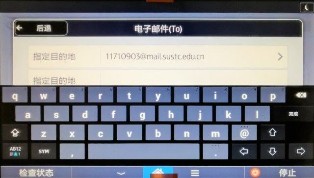
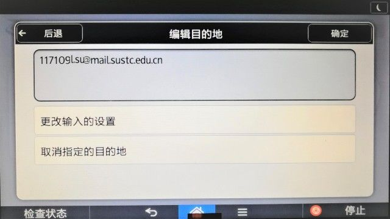

# 🖨️联创打印系统

学校在校园各处通过联创打印系统为同学提供打印，复印及扫描服务。

### 报障

若打印机出现故障或缺纸，可以通过拨打信息中心电话[88010777](tel:+86-0755-88010777)报障。

## 打印/复印一体机地点

> **提示**： 前去打印前可提前在[「打印点」页面](http://pms.sustech.edu.cn/client/new/cprintPc/printDev.html)确认打印点可用状态。

|             名称             |  纸质  |                            功能                             |
| :--------------------------: | :----: | :---------------------------------------------------------: |
|        琳恩图书馆一楼彩色        |   A4   |  打印,复印,扫描,支持彩色 |
|        琳恩图书馆三楼彩色        |   A4   | 打印,复印,扫描,支持彩色  |
|      第一教学楼二楼彩色      |   A4   |  打印,复印,扫描,支持彩色 |
|      第一科研楼二楼彩色      |   A4   |  打印,复印,扫描,支持彩色 |
|      第一科研楼三楼黑白      |   A4   |                       打印,复印,扫描,                       |
|      第二科研楼四楼彩色      |   A4   | 打印,复印,扫描,支持彩色  |
|      第二科研楼四楼黑白      | A4、A3 |                       打印,复印,扫描,                       |
|      第二科研楼五楼彩色      |   A4   | 打印,复印,扫描,支持彩色  |
| 生物楼（第三科研楼）一楼彩色 | A4、A3 | 打印,复印,扫描,支持彩色  |
| 台州楼（第四科研楼）一楼黑白 | A4、A3 |                       打印,复印,扫描,                       |
| 一丹图书馆一楼黑白 | A4、A3 | 打印,复印,扫描, |
| 一丹图书馆二楼黑白 | A4、A3 | 打印,复印,扫描, |
| 一丹图书馆二楼彩色 | A4、A3 | 打印,复印,扫描,支持彩色 |
|       书院1栋大厅彩色        |   A4   | 打印,复印,扫描,支持彩色  |
|       书院2栋大厅黑白        |   A4   |                       打印,复印,扫描,                       |
|       书院3栋大厅彩色        |   A4   | 打印,复印,扫描,支持彩色  |
|       书院3栋大厅黑白        |   A4   |                       打印,复印,扫描,                       |
|       新生宿舍11栋2楼        |   A4   | 打印,复印,扫描,支持彩色  |
| 涵泳图书馆一楼彩色 | A4、A3 | 打印,复印,扫描,支持彩色 |
|       教师公寓三栋一楼       |   A4   | 打印,复印,扫描,支持彩色  |
|       荔园1栋二楼彩色        |   A4   | 打印,复印,扫描,支持彩色  |
|       荔园1栋二楼黑白       |   A4   | 打印,复印,扫描  |
|         创园一栋三楼         |   A4   | 打印,复印,扫描,支持彩色  |
|       创园五栋一楼黑白       |   A4   |                       打印,复印,扫描,                       |
|       创园七栋一楼黑白       |   A4   |                       打印,复印,扫描,                       |
|       创园九栋一楼彩色       |   A4   | 打印,复印,扫描,支持彩色  |
|       慧园1栋二楼彩色        |   A4   | 打印,复印,扫描,支持彩色  |
|       慧园5栋三楼黑白        | A4、A3 |                       打印,复印,扫描,                       |
|    欣园二栋活动室一楼彩色    |   A4   | 打印,复印,扫描,支持彩色  |
|       欣园四栋一楼彩色       |   A4   | 打印,复印,扫描,支持彩色  |

数据来自[联创打印系统](http://pms.sustech.edu.cn/client/new/cprintPc/printDev.html)。这些打印点的详细地图可以参考[校园地图](/#校园地图)。

**虽然在打印系统上显示支持A3纸张，但实际上这些打印机一般不会装载A3纸张，也就无法打印出A3幅面的文档了。**

## 打印教程

### 通过浏览器

**（适用于大多数操作系统）**

用浏览器打开联创网页：[http://pms.sustech.edu.cn](http://pms.sustech.edu.cn)，如果打不开可尝试[http://172.18.1.141](http://172.18.1.141)

点击云打印，登陆账户，按照提示操作。

### 通过本地程序

**仅限Windows系统**

1. 在云打印主页下载驱动程序并安装：[下载链接（内网）](http://172.18.1.141/client/UniOpmClient_Setup.exe)

2. 在电脑中找到所需打印的文档，然后点击右键选择打印；按照系统要求操作即可，操作完毕后可以在打印文档列表中找到该文档。

3. 前往打印点打印文件：点击自助打印，转换页面后在感应区放置校园卡（若打印多张需多次放置）即可到打印机旁等待任务完成，取走文件。

初始界面

打印初始界面

打印确认（多个任务需重复刷卡）

打印成功界面

## 复印教程

1. 携带校园卡及所需打印文件至打印点；
2. 点击自助复印，转换页面后在感应区放置校园卡，然后到打印机电子版面进行操作。

3. 点击快速复印图标进入如下页面可对复印进行编辑，其中其他栏中包括缩小放大，双面复印，多合一等功能，在这里不做过多介绍，大家可以自行尝试。

复印初始界面

4. 点击开始按键即可开始复印（注意：如若需要正反扫描，或是多合一时要在第一张扫描完成且屏幕上方弹出提示窗口后对文件进行手动翻面并再次点击开始图标）。

其他栏

双面（正反面复印）

多合一（将所需复印的多面文件复印至单面）

5. **注意：在放置文件时，若是A4大小，请不要超过扫描机上方刻度的A4线位置，否则超出部分将无法被扫描并复印。**

## 扫描教程

*Created by Xinge GUO*

### 施乐/佳能机型

1. 刷卡

2. 点击机器上的 `扫描仪`，进入扫描界面

3. 如果出来的是这个让人看起来就很绝望想把机器砸了的界面

    

    先冷静一下，点击右边的 `简单画面` 。

    

    然后就会变得很友好了：

    

4. 清晰度设置

    点击左上角的 `扫描设置`，设置扫描清晰度，一般直接设成最高（600dpi）：

    

5. 设置文件类型

    点击左下角的 `文件类型`

    

    * 单页：扫描结果会变成每份只有一面内容的 pdf 上传
    * 多页：扫描结果会合并成一个多面的 pdf 上传
    * 文件类型：根据需要
    * PDF 文件设置：有兴趣的可以自行百度，一般用不上，不需要设置

6. 设置文件上传位置

    

    文件夹 → SCAN

    文件会保存在你刷的校园卡的联创里，如图：

    

    亦可选择直接发到自己的邮箱中，不过需要先再点击一开始的 `简单模式`，进入设置界面：

    

    选择 `手动输入`，输入自己的邮箱

7. 点击机器上的开始

    

8. 结束扫描

    需先点击 `#` 键，再刷卡退出

    

### 富士机型

1.携带校园卡及所需扫描文件至打印点；

2.点击自助扫描，转换页面后在感应区放置校园卡，然后到打印机电子版面进行操作。

扫描准备页面

3.点击快速扫描图标进入如下页面，点击目的地进行接收地址填写

初始页面

4.地址填写：选择电子邮件，转换页面后输入想要接受扫描文件的邮箱地址，输入完毕后点击屏幕空白处收起键盘，点击所输入的邮箱地址进入确认页面。

地址输入页面

5.进入确认页面后可再次确认地址，并可进行更改操作，若确认无误，点击屏幕右上方确认键转跳页面。

确认页面

6.页面转跳后进入初始页面，并可看到将要接收扫描邮件的电子邮箱。在此页面可设置扫描参数，并可继续添加电子邮件地址。确认无误后点击开始按键即开始扫描。

## 参考资料

- [南科大生存必备技能 | 联创打印管理系统指南/南科新知](https://mp.weixin.qq.com/s/NVTW8LRSUpr793Dho8GYxA)
