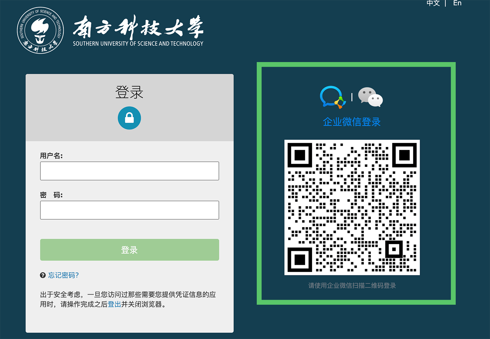

# 企业微信

学校通过企业微信提供部分通知和校内服务。新生和新入职人员的加入、激活与身份绑定方式可能调整，请以学校当期通知和企业微信中的组织邀请为准，不扫描来源不明的“激活”二维码。

## 通过企业微信登陆CAS

完成学校组织身份绑定后，如果 CAS 登录页显示企业微信扫码入口，可使用企业微信扫描页面上的官方二维码登录。应先核对地址栏是否为南科大官方 CAS 域名；证书或域名异常时停止扫码和登录。

## 使用企业微信联系同学

通讯录、聊天和手机号是否可见，取决于学校当前租户权限、成员身份及个人隐私设置，不能假定所有学生都能搜索、联系或查看所有成员信息。

不得批量收集、导出或传播校内通讯录信息。分享截图前应遮盖姓名、手机号、学工号、部门和水印等个人信息；不要用截图水印替代隐私保护。学校统一身份认证的数据使用边界可参考[CAS 隐私政策](https://cas.sustech.edu.cn/privacy.html)。

