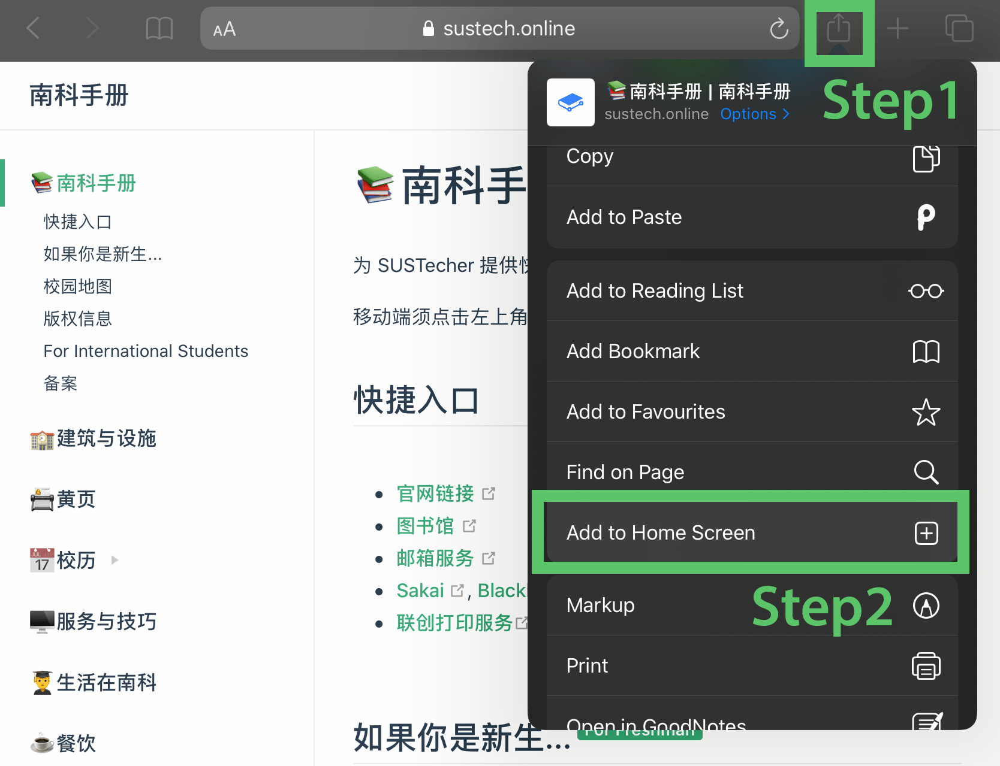
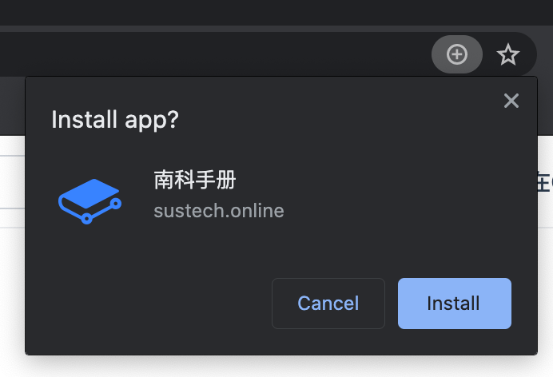

# ❓站点帮助

## 添加南科手册到桌面

南科手册支持[PWA](https://sspai.com/post/60928)[(Progressive Web App)](https://web.dev/progressive-web-apps/)，这意味着您可以将它添加到桌面，并作为一个本地应用使用。因此，在下载应用后，即使在网络不佳的环境下，您依然可以阅读南科手册上的内容。

### Andoid

以Chrome为例：

1. 点击右上角的三个点

2. 点击“添加到主屏幕”

3. 点击“添加”

### iOS

在Safari中打开南科手册**（只有Safari可以添加）**

按图示操作即可：点击**图标**-**添加到主屏幕**。

### 桌面设备（Windows/Mac OS X）

以Chrome浏览器为例，Edge或是其他国产浏览器流程类似。

点击地址栏右侧的**加号**➕，点击**安装**即可添加到桌面。

