# 致诚书院新生攻略——学习篇

[[toc]]

## 入学考试

南科大新生入学考试安排在新生适应周，根据21届的校历安排，应该是安排在刚刚开学时的军训周（具体时间关注校内通知）。考试只考两门，即英语和计算机，而且目的是为了根据大家的水平给予选课的方案，属于分级考试而非选拔性考试，因此大家不必太担心，以从容的心态准备和面对就好。下面给大家从不同方面简单介绍一下这两门考试，以便大家更好的准备！

### 英语

#### 考试内容

英语分级考试并分为两部分：听力和阅读，题目与形式与托福考试类似，同学们可以在假期在网上或者购买托福的原题练习，会对考试有一定的帮助。（手机APP推荐：小站托福；电脑网站推荐：①小站托福[http://top.zhan.com/toefl/](http://top.zhan.com/toefl/) ②雷哥网托福[https://toefl.viplgw.cn/](https://toefl.viplgw.cn/)）

#### 考试形式

笔试，2个小时

#### 考试结果

考试结束后，老师们会根据大家的考试成绩并结合大家的英语高考成绩与适应周英语课上大家的表现，综合评定后，将英语水平分为I II III 三个等级，水平依次递增，同学们根据自己的等级开始学习对应的英语课程。

图：三种水平对应的需要修读的英语课程（每学期一门）

### 计算机

#### 考试内容

计算机分级考试不会很难，会考察大家一些计算机的基础知识、逻辑、进制转换、伪代码、Java编程等。编程题也不会为难大家，一般是看程序选择输出结果或者选择一个选项完善程序之类的，大家不用过于担心，不过假期可以对以上内容进行一个简单的了解做一些准备。

#### 考试形式

根据20级的经验，应该还是以笔试并且全部是选择题的形式。

#### 考试结果

计算机分级考试的结果只分为通过与不通过两种，通过后可以直接修读“计算机程序设计基础”（通识必修课）这门课程，但如果未能通过的话，需要先修读并通过“计算机导论B”这门课程后，方能修读“计算机程序设计基础”。

总之，南科大的分级考试主旨是为了帮助大家更好的学习大学课程，并不会对大学的成绩造成任何影响，因此学弟学妹们不必过于紧张。不过在考试前按照上述内容科学的备考，争取考出一个较好的成绩，还是对减少一些学业的压力有一定的作用的！预祝大家考试顺利！

## 专业与选课

专业问题是南科大学生在之后会一直关心和迷茫的事情，无论你们现在是不是已经有了目标，去了解专业将是你们之后一定会做的事情呢。而且专业的选择直接关系到了选课，选课也有很多学问，我们为大家总结了专业相关和一些选课要知道的事情，让大家以后不会太手忙脚乱!

### 专业

#### 专业设置

因为排版问题放不下啦，在下一页哦！

#### 专业选择方面的一点点提醒

虽然南科大是自由选择专业，但还是需要心里有一点方向的！因为大家开学之后选课是要根据以后要进专业的先修课选择的。比如说，如果你要1+3进数学系或者统计系，你大一上就要开始学数学分析，另外的同学就只需要学高等数学。如果没有确定的方向也不用太担心，一般情况下不同专业都有很多重叠的通识课，你可以选出你感兴趣的几个专业重叠的课程在上学期上，在上学期好好了解自己感兴趣的几个专业，下学期就学这个专业剩下的先修课就好啦。当然如果你没有很强的1+3进专业的意愿的话，你还有一年的探索时间，甚至有机会临时反悔，也可以选择一些专业的先修课看看自己适不适合。

#### 专业确定的一点点方法建议

①网上了解相关院系的情况：导师及专业的科研情况等等

②与感兴趣的院系的老师们联系，多多交流（注意礼貌！），找到自己感兴趣的科研方向很重要！

③与大三大四的学长学姐多聊一聊，了解自己以后可能会经历什么，要做什么准备等等

图：南科大本科生可选专业院系设置汇总

④兴趣！当然很重要，这个可以应用于排除法hhhhh

### 选课

#### 选课方法

大家开学的时候会收到一个大厚本，就是2021级的培养方案啦！因为我们现在也没有大家的培养方案，因此介绍时就以2020级的培养方案为例，都是一样的，可能会有轻微变动而已，大家清楚里面有什么就可以啦！

① 学分限制

选课的学分是有界限的，下限15，上限25。就是告诉大家，不要上不够课，也不要上太多课，注意劳逸结合哈。

图：课程结构总结（参考2020级培养方案）

②课程结构

③ 通识课程

体育课大家都必须选体育I，英语要根据大家入学等级测评的结果来选择，思政课在下面四个任选一个（在四年里修完这四门就行，如果学分不够了可以放弃一学期，体育和英语也是同理）

图：大学四门思政课要求

另外大一上下两个学期必须有一个学期选一门叫做写作与交流的课。

大家大学四年必须修够人文课程2学分，社科课程2学分，艺术课程2学分（有些艺术社团是可以提供学分滴），至于什么时候选这些课程就完全看你啦，有早早修完的，也有等大三大四课变少之后再选的（说是用来养老的）。

④ 先修课

大家的培养方案每个专业上都会有这样的一页（又在下面sos）。根据这个来选择一个学期的课程就好啦，注意均匀分开两学期的课程。

P.S.这里建议一定要咨询一下学长学姐课程的难度，比如线代和Java就不适合放在一个学期学，两门课任务都比较重，在一个学期会比较辛苦。当然如果你有信心能处理的话这都不是问题哈哈。

刚刚也提到了可以先选感兴趣专业重叠的课程。

另外，如果你入学等级考试计算机没有合格的话，第一个学期是选不了Java的，必须要先修计算机导论的课程。

图：计算机科学与技术先修课示例

#### 选课流程

选课的流程一般是这样的：查看课程信息——积分选课——退补选课——导师确认

下图是我们为大家总结的流程图：

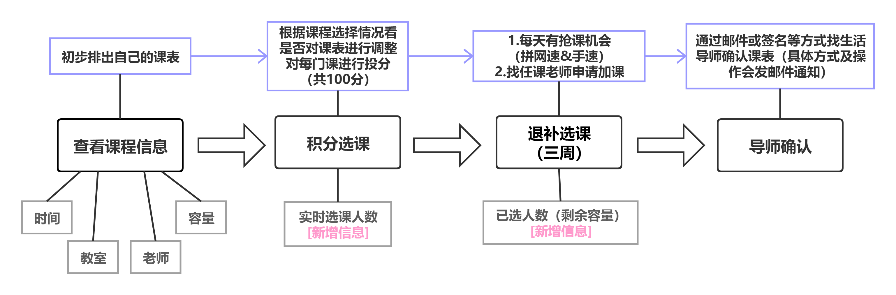

图：选课流程总结

①查看课程信息：

这个环节大家可以看到完整的排课信息了，哪门课什么时间哪位老师，这个时候大家可以开始了解课程并开始选择了，在这个阶段可以先排好自己的课表（虽然大概率以后会改）。建议大家选一门课的时候问问学长学姐有没有推荐的老师以及课程难度（受欢迎的老师并不一定适合所有人，不要追求老师选的人多不多，多问问老师讲课的风格和习惯的讲课方式等等！！这个挺重要的）。

②积分选课：

这个阶段每个人一共有100积分，为你想选的课程投入一定的积分。比如一节课容量50人，他们投入的积分从高到低排，前50人就选上这门课了，如果最后几名投入积分相同，则都落选。这是一场博弈啊博弈！到时候一门课有多少人选择也会一直更新，当然你看不到他们投入的积分，能不能顺利选到这门课，就看你的脑袋瓜和运气了。（刚刚说到的课表会变动的情况就从这里开始了，很可能你的计划被迫改变，包括下面的阶段）

③退补选课：

这个阶段，是拼网速的时候了。这时候所有因为各种原因容量没有满的课程，都会在每天中午一点开放抢课，不用积分，先到先得。还有一种方式，就是直接找老师申请加课，注意礼貌！但有些老师会同意，有些老师可能因为教师容量问题没办法同意，建议一定要提前向学长学姐了解一下什么课比较好加上，可以考虑先保住其他课程，如果情况很严峻的话（这应该在积分选课阶段为这里做准备）。

④导师确认：

最后一个环节是如果你的课表不打算再更改了，可以通过系统让你的生活老师确认你的课表，这个时候的课表就成为了你的最终课表了（确认的具体操作会发邮件通知）。当然，不是这个时候你才可以联系导师，前面如果你对你的选课有迷茫，也是可以找生活导师寻求建议的！

上面的很多环节到时候都会有邮件通知或有讲座讲解，这里希望同学们先了解一个大概，另外给了一些官方不会讲到的建议，只希望到时候大家不会听不懂或者不了解情况啦。

## 英语学习

### 英文教学

#### 南科大的课程主要分为中英双语班和英文班

中英双语班：一般来说老师的 ppt 是几乎全英的（会有个别

中文注释~），但老师会用中文上课，所以大家的对知识的理解不会有问题啦~

英文班：英文班当然就是 ppt 和老师上课都是英文的了，但老师的语速大多比较慢，说到比较难的单词也会加上中文翻译， 所以听懂课堂内容也不是那么困难滴~（如果英文班没有国际生的话，事情就好商量了，老师会多说一些中文的，但上英文班确实是可以帮助记单词滴）

 2）一点小建议：一般来说高数和大物课建议选中英双语课。当然，如果“博弈”（积分选课）失败的话可能就会被迫选全英班了。大家还是需要根据自己的英语水平决定，也可以参考英语分级考试的等级哦~

### 四六级考试

- 目前，南科大的学生在入学的第一个学期（也就是 12 月）是不能考英语四级的，大家在第二年 6 月才能开始四六级的考试，有特殊情况注意邮件通知。

- 同学们在大一下学期一定要注意翻看邮箱，不要错过了四六级考试的报名时间（记得要交报名费鸭！，不然就得再等半年啦~）

- 四级考试难度不大，大家复习一下词汇，做几套真题应该就没什么问题了（如果想要拿很高分还是要多花些力气哒~)，主要是熟悉题型与考试流程。不要像个别学长学姐一样不了解题型，直接被听力炸懵。
- 六级就有些难度了，需要大家比较认真复习了（当然学霸除外啦~）

### 雅思 & 托福 & GRE

1. 托福跟雅思一样都是语言能力测试， 而 GRE （ Graduate Record Examination）是指美国研究生入学考试，关注的是逻辑水平和学术能力

2. 雅思和托福的有效期都是 2 年（这个可能根据学校的具体要求有所不同)，而 GRE 的有效期是 5 年

3. 一般申请英联邦国家的研究生项目，如：英国、澳大利亚、新西兰、加拿大、新加坡等，或者中国香港的大学，就需要提供雅思成绩

4. 申请美国的研究生项目，就需要提供托福和 GRE 成绩。

5. 南科大有很多寒暑假或者整个学期的出国科研或游学项目，一般都会发邮件通知，欢迎大家关注“南科大国际合作部”公众号或官网[https://global.sustech.edu.cn](https://global.sustech.edu.cn ) 自行了解。有些项目需要提供雅思或托福语言成绩，所以有意向的同学需要自己规划考语言成绩 

## 学习方法

### 改变认知

大学的学习内容和高中有很大差别。相比于高中来说，大学课程的节奏更快、设计范围更大。往往老师上课只讲了最重要的部分，需要自己在课余时间花费更多的精力来补充学习。尤其是南科大的英语教学模式，这就更加需要我们在课下做好充足的准备。所以大学学习的最首要的改变就是认知上的改变。我们要认识到大学与高中学习方式上的差别，积极探索新的适合自己的学习方式。这要才能避免陷入被动，收获好成绩。

### 各科推荐学习方法

#### 数学

在南科大数学大一的学习中，主要分为高等数学类（数学分析，高等数学 A 以及高等 数学 B）和线性代数类（高等代数，线性代数 A 以及线性代数 B）。不同专业的数学先修课 程是不同的，大家一定要参考培养方案进行选课。

①数学分析

数学分析这门课程主要是针对想要进入数学系的同学，对同学们证明方面的要求比较严格。这门课程的难度是非常高的，想要漂亮 gpa 的同学需要慎重考虑噢！

这门课程对逻辑的要求相当严格，所以预习是十分重要的，大家如果想在暑假期间了解 这门课程的话，可以先去浏览一些相关的教材。

教材：常庚哲，史济怀《数学分析教程》

②高等数学

高等数学的适用对象为除数学系外的其它专业的学生，且更偏向于应用。 

教材与教参：

高数课本 Thomas’ Calculus (13th Edition)

高数中文参考书 同济大学数学系编《高等数学》高等教育出版社

​            

 

③高等代数 

高等代数完全是针对想进入数学系并且想攻读数学与应用数学专业的学生。这是一门难 度非常大的学科，需要耗费很多的时间。

和数学分析一样，对于这类课程，提前预习和保证思考的纯粹是相当重要的。并且因为 章节知识的连贯性很强，所以在学习过程中建议频繁的进行自我复习。

教材:李炯生,查建国,王新茂《线性代数（第二版）》

④线性代数 

线性代数分 A、B 两级教学，A 级适用对象为数学及物理等对数学要求较高的学 生；B 级适用对象为所选专业对线代或数学要求较低的学生。

刚开始接触这门课的时候或许会感到有些吃力，但只要跟着老师的进度，认真做笔记， 写作业，之后就会越来越得心应手。学习的过程中不要死记硬背，注重对概念的理解，打牢 基础。

教材与教参：Gilbert Strang: Linear Algebra and its Applications (4th Edition)

​             

 

#### 物理

大学物理分 A、B、C 级进行教学，A 级面向物理专业学生，B 级面向物理专业或其它 理工科专业学生，C 级面向非理工科专业学生。 

①大学物理 A 

大学物理 A 面向物理专业学生，难度稍大，适合在高中对大学物理有所了解，对物理 有着浓厚兴趣并且数学基础较好的同学。如果想要在这门课上拿到一个比较高的等级就要付 出很多的时间去钻研，所以同学们一定要慎重考虑呀！可以点击下方链接下载教材来了解一 下难度哦！

教材：伯克利物理学教程第一卷（力学）

伯克利物理学教程第三卷（波动）

Electricity and Magnetism

PS：大学物理 A 里的热学与近代物理的教材和大学物理 B用的是同一本。 

   

②大学物理 B 和大学物理 C 

大学物理 B 面向物理专业或其它理工科专业学生，大学物理 C 主要面向金融方面的专业的学生。教学大纲与高中所学内容基本一致，只是在教学内容和教学难度上进行了一定的丰富和拔高。 

教材：Principle of Physics

​              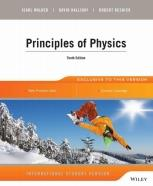

③物理实验 

旨在培养严谨的科学思维和创新能力，培养理论联系实际特别是与科学技术发展相适应的综合能力。

参考书：《大学物理实验（第一册 第二版）》高等教育出版社 （可在图书馆借到或在跳蚤市场上收二手书）

​               

#### 生物

生物分两级教学，A 级的学习侧重于看论文做深入研究，主要面向生物专业、其它对生 物有较高要求专业的学生，B 级的学习背诵的内容更多，主要面向其它对生物有一般要求专业的学生。

参考资料：Campbell Essential Biology with Physiology

​             

 

#### 化学

《化学原理》分两级教学，A 级面向化学专业、其它对化学有较高要求专业的学生，B 级面向其它对化学有一般要求专业的学生。相较于 B 级，A 级的学习内容要更加充实。    参考资料：Chemistry the Central Science

​               

ps：如果生物和化学在同一学期内同时选修，那么本学期将会有很硬核的背诵任务！所以同 学们最好不要同时修习这两门课呀！ 

#### 计算机

①计算机导论 

《计算机导论》分两级教学，通过计算机能力测试的学生可选修《计算机导论 A》，未通过的同学则必修《计算机导论 B》。 

参考书及参考资料： Computer Science an Overview (12th Edition)《计算机科学概论》

②计算机程序设计基础

《计算机程序设计基础》分两级教学，A 级面向计算机专业、其它对计算机有 较 高要求专业的学生，B 级面向其它对计算机有一般要求专业的学生，编程语言为 Java。 （注意：必修《计算机导论 B》的同学只有 pass 了这门课才能修《计算机程序设计基础》）

参考书：Introduction to Java Programming (10th Edition)

Java: How to Program (8th Edition)

​              

# 学习工具

## 笔记能手

#### 纸质笔记vs电子笔记

同学们可以根据自己的好恶选择

纸质笔记：

1. 同学们可以继续保持自己高中所留下来的习惯，容易快速适应
2. 分页整理，查看起来比较方便，可以同时看多份资料
3. 条理清楚，写一遍使人印象深刻，也可以时常复习

4. 便于提交纸质版作业，不需要打印

电子笔记：

1. 有许多强大软件，实现更多功能

2. 方便在电子文档中做注释，笔记方便修改与清除

3. 电子版笔记方便交流，导出PDF便利

4. 有些软件可以录音，方便复习

### 软件分享

#### 网易有道词典（PC端）

有道词典PC端可以帮助我们快速适应大学生活，其中最常用的功能就是截屏翻译功能。这个功能可以提高我们阅读英文的速度，提高效率

 

 

### Quizlet

Quizlet是南科大英语学习一般都会用到的一个软件。

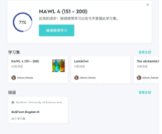

老师通常会利用Quizlet来帮助大家学习NAWL与NGSL词汇。没有用过的小伙伴也不用着急，英语课上老师会教大家如何安装与使用。 

#### MyScript Calculator

MyScript Calculator是一款手写计算器

相比于普通的计算器效率有明显提升，但是因为考试时不允许使用手机或pad，小伙伴们要在具有一定计算能力之后再使用噢~

#### Notability/GoodNotes

使用pad记笔记的软件主要以Notability和GoodNotes居多。

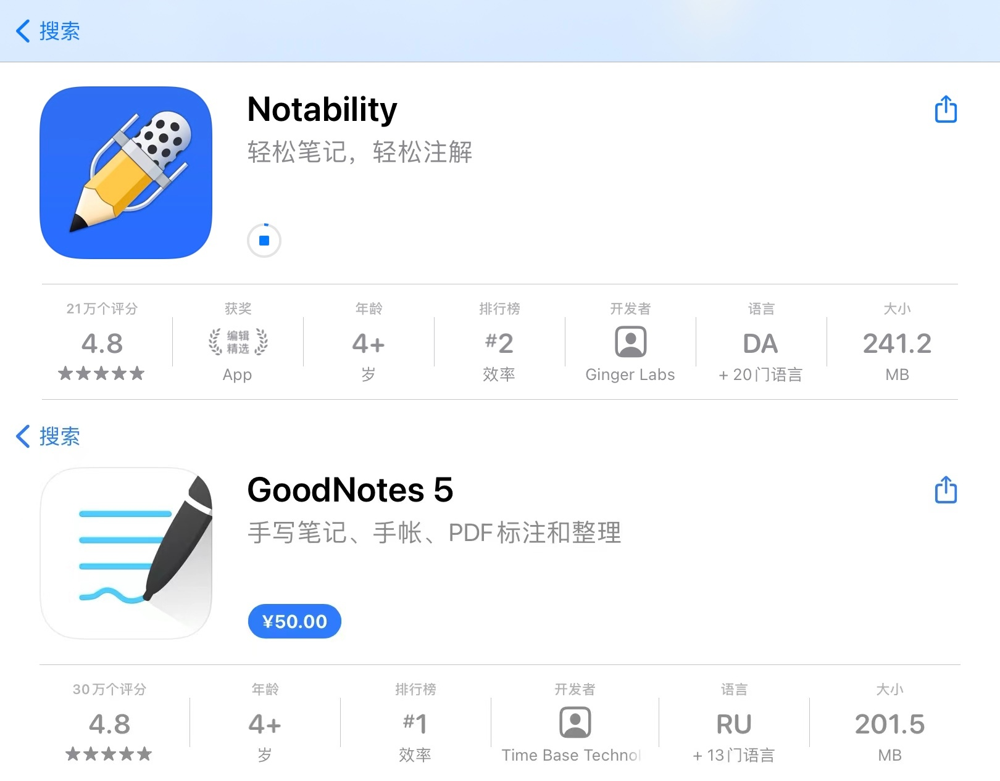

两个软件各有优劣，价格也不同，同学们可以根据自己的需求进行选择。

#### QQ邮箱

南科大很多事情会以邮件的形式通知，同学们最好养成定期查看邮件，管理邮件的习惯，开学后根据同学们的学号会有相应的腾讯企业邮箱，使用QQ邮箱可以同时管理多个邮件地址。

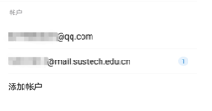

### 3．校内学习相关网站

本介绍旨在帮助新生了解南科大学生常用的学习系统的进入方式与用法，希望大家能更好的融入大学学习生活！ 

1） 南科大官网：[https://www.sustech.edu.cn/](https://www.sustech.edu.cn/ ) （建议收藏进浏览器收藏夹）

2） 南科大学生常用系统页面：官网内单击学生即可跳转至该页面。

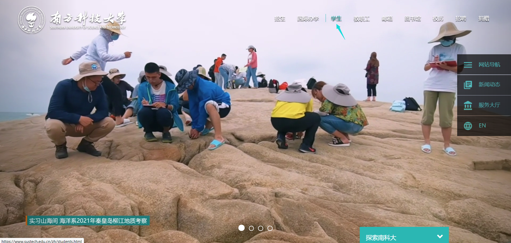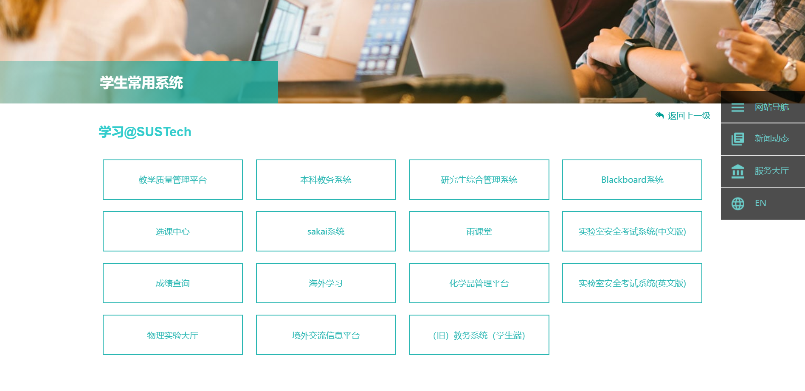

在学生常用系统中，包括学习部分、生活部分以及其他相关链接。下面就为大家详细介绍一些学习相关的系统。

3） 本科教务系统

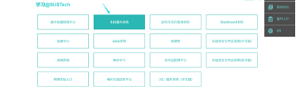

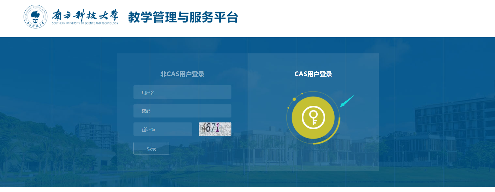

进入后选择CAS用户登录。

注：CAS系统为南科大学生与教职工所拥有的系统，学生的账号为学号，初始密码为身份证后六位，几乎所有系统包括WiFi的登录都需要CAS账户登录。

进入后，有关功能的全部选项集中在右下角处：包括业务查询、业务办理和选课业务。 

① 业务查询中包括如图所示的几类，日后同学们也会用到，常用的有考试查询、成绩查询、绩点查询、全校课表等。

 

② 业务办理（如下图）：比较常用的是场地借用申请，点击进入之后再单击“添加场地借用”即可借用教学区的教室啦，通常可以借教室进行班会，pre练习等活动哦。

 

 

③ 选课业务：包括选课和加课两项业务功能，是进行积分选课、抢课、退课、加课的主要战场！选课具体流程参考攻略上方的介绍！

点击进入“我要选课”后，即可看到选课信息。最上方可以搜索课程，左上方有课程类别，同学们搜索课程时一定要主义好下方类别是否对应，避免出现找不到的情况。每个课程右侧会显示课程容量与已选人数、冲突课程等，大家要据此来选择课程与判断投入积分的多少！如果点击最左侧“已选”的话，便能查看自己的选课情况，并可以进行更改积分和退课等操作。大学长们也会在大家第一次选课时期给予相应的指导，同学们可以多与大学长沟通以便更好地安排自己的课程哦！

 

4） Blackboard系统

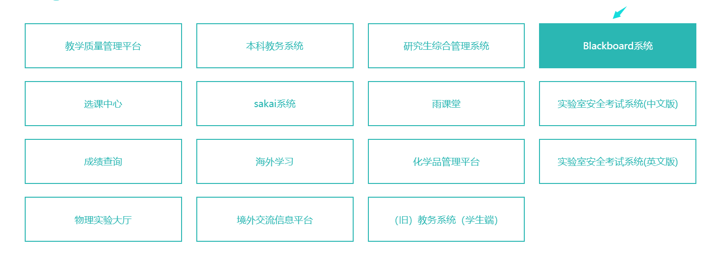

Blackboard系统，简称BB系统，是南科大教学常用的系统之一，很多课程（如高数、线代等）都会通过该系统发布通知、课件、作业、成绩等，也可以通过BB系统完成作业提交。点击进入并完成登录后，即可进入该系统。

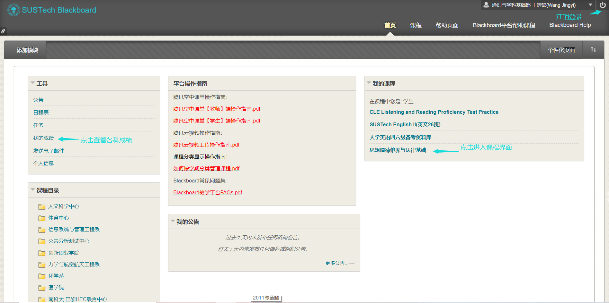

课程开始后，老师或助教会将同学们拉入对应的课程平台，点击进入后，可以看到老师发布的各种信息：如课程内容、考核方式、课件、作业提交入口等。下图为2020年秋季杨少曼老师思修课平台，供大家参考。

对于提交作业，一些课程（如高数、线代）虽然会在BB上开通平台，但提交作业采用的是线下的方式，提醒大家在学期初要仔细听好老师的要求哦！也有一些课程，如写作与交流、思修（根据授课老师而定）会采用线上提交的方式，具体操作步骤见下图：

 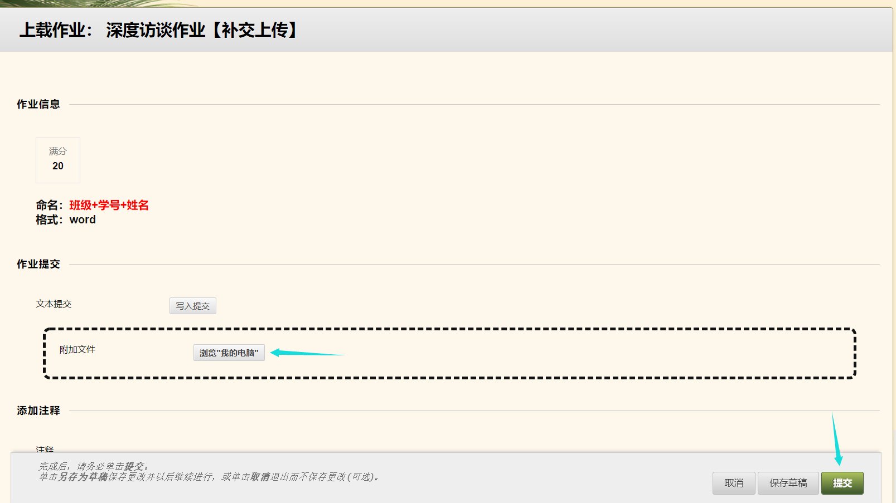

同时，提醒大家网上提交作业一定要注意ddl！！！迟交或者忘交都是会扣分的哦！

 

5） Sakai系统

与BB系统并行的另一大重要的教学常用系统，功能与BB类似，大物、Java课程便会用到该系统。点击进入并单击上方log in 即可登录进入系统。

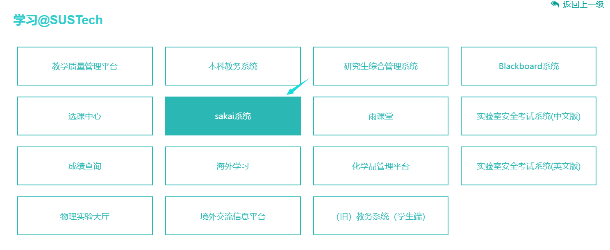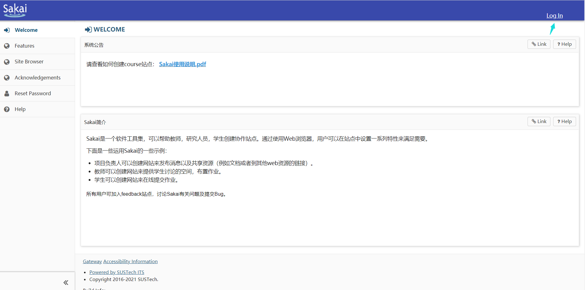

与BB相同，课程开始后老师或助教会将同学们拉入站点，进入后左侧为菜单栏：单击作业/Assignment即可查看作业提交状态与开始和结束时间。单击左侧作业标题即可进入提交作业界面。同样提醒大家注意作业提交的ddl哦！（下图为2021年春季刘畅老师大物下站点，供大家参考）

 

作业提交结束的几天后，老师会在站点给同学们打分并标注错误的题号，大家可点击左侧的成绩册/Gradebook查看自己的得分情况。

 

6） 图书馆

 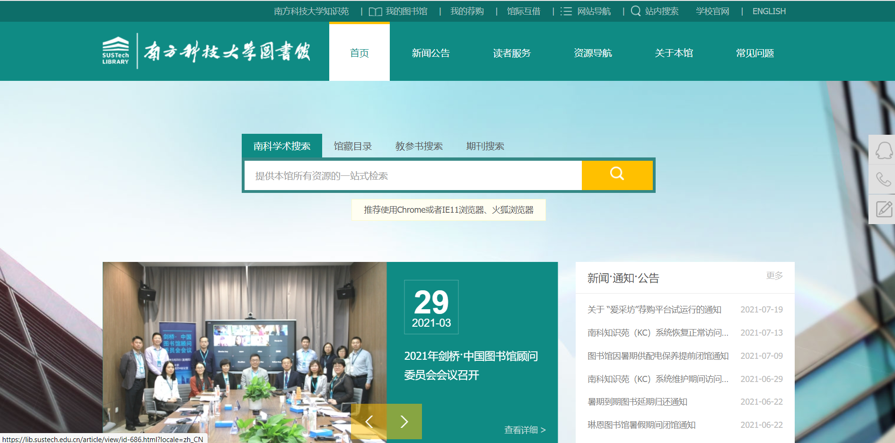

有关馆内资料的搜索与图书借还事项开学后图书馆会安排视频讲解，这里为大家介绍一下图书馆预约功能。进入大学后，很多课程避免不了都要进行小组合作项目，因此图书馆讨论间便成为了一项非常重要的资源，在讨论间同学们可以进行小组项目的讨论，也可以约上三五好友在期末复习周时在讨论间一起讨论问题。

 

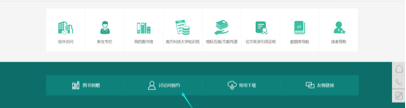

将图书馆主页面拉到下方即可看到讨论见预约按钮，也可以通过学生常用系统中的“图书馆讨论间预约”直接进入。

进入并登录后，在资源列表中选择所需要预约的讨论间并按照指示完成预约即可！

首次预约前，记得阅读预约须知哦！最重要的注意事项包括：①三人以上才可预约，②通过刷卡确认签到，超过十五分钟未签到按照违规处理，违规会取消预约权限一周等。

## 必备小工具

计算器：大学与高中的不同之一就在于一些考试能使用计算器了！比如大物、化学等科目更侧重与对知识和能力的考察，因此可以在考试和平时作业时使用计算器，所以人手一个计算器是十分重要的！

::: tip 版权信息
**图片来源：** App Store，软件截图，网站截图、2020级南方科技大学本科生人才培养方案、唐昕宇

**资料参考：** 2020致诚新生攻略之英语学习篇、2020致诚新生攻略之课程学习篇、2020级南方科技大学本科生人才培养方案

**特别鸣谢**： 杨少曼老师大一上思修BB站点、刘畅老师大一下Sakai站点

**制作：致诚书院大学长团 段宜凯 贾松硕 王婧懿 唐昕宇**

致诚书院出品，转载请注明出处
:::

