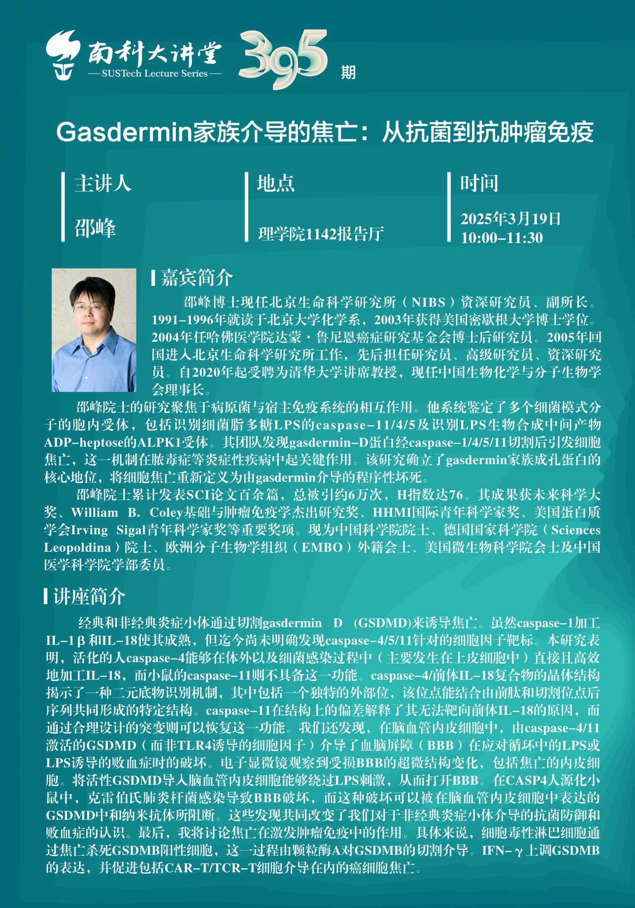

# 《南科大讲堂第395期》邵峰：Gasdermin家族介导的焦亡：从抗菌到抗肿瘤免疫

* 题目: Gasdermin家族介导的焦亡：从抗菌到抗肿瘤免疫
* 主讲人：邵峰 @ 北京生命科学研究所（NIBS）资深研究员、副所长，清华大学讲席教授，中国生物化学与分子生物学学会理事长
* 时间：2025年3月19日 10:00-11:30
* 地点：理学院1142报告厅

## 主讲人简介
邵峰博士现任北京生命科学研究所（NIBS）资深研究员、副所长。1991-1996年就读于北京大学化学系，2003年获得美国密歇根大学博士学位。2004年任哈佛医学院达蒙·鲁尼恩癌症研究基金会博士后研究员。2005年回国进入北京生命科学研究所工作，先后担任研究员、高级研究员、资深研究员。自2020年起受聘为清华大学讲席教授，现任中国生物化学与分子生物学学会理事长。

邵峰院士的研究聚焦于病原菌与宿主免疫系统的相互作用。他系统鉴定了多个细菌模式分子的胞内受体，包括识别细菌脂多糖LPS的caspase-11/4/5及识别LPS生物合成中间产物ADP-heptose的ALPK1受体。其团队发现gasdermin-D蛋白经caspase-1/4/5/11切割后引发细胞焦亡，这一机制在脓毒症等炎症性疾病中起关键作用。该研究确立了gasdermin家族成孔蛋白的核心地位，将细胞焦亡重新定义为由gasdermin介导的程序性坏死。

邵峰院士累计发表SCI论文百余篇，总被引约6万次，H指数达76。其成果获未来科学大奖、William B. Coley基础与肿瘤免疫学杰出研究奖、HHMI国际青年科学家奖、美国蛋白质学会Irving Sigal青年科学家奖等重要奖项。现为中国科学院院士、德国国家科学院（Sciences Leopoldina）院士、欧洲分子生物学组织（EMBO）外籍会士、美国微生物科学院会士及中国医学科学院学部委员。

## 讲座简介
经典和非经典炎症小体通过切割gasdermin D (GSDMD)来诱导焦亡。虽然caspase-1加工IL-1β和IL-18使其成熟，但迄今尚未明确发现caspase-4/5/11针对的细胞因子靶标。本研究表明，活化的人caspase-4能够在体外以及细菌感染过程中（主要发生在上皮细胞中）直接且高效地加工IL-18，而小鼠的caspase-11则不具备这一功能。caspase-4/前体IL-18复合物的晶体结构揭示了一种二元底物识别机制，其中包括一个独特的外部位，该位点能结合由前肽和切割位点后序列共同形成的特定结构。caspase-11在结构上的偏差解释了其无法靶向前体IL-18的原因，而通过合理设计的突变则可以恢复这一功能。我们还发现，在脑血管内皮细胞中，由caspase-4/11激活的GSDMD（而非TLR4诱导的细胞因子）介导了血脑屏障（BBB）在应对循环中的LPS或LPS诱导的败血症时的破坏。电子显微镜观察到受损BBB的超微结构变化，包括焦亡的内皮细胞。将活性GSDMD导入人脑血管内皮细胞能够绕过LPS刺激，从而打开BBB。在CASPH4人源化小鼠中，克雷伯氏肺炎杆菌感染导致BBB破坏，而这种破坏可以被在脑血管内皮细胞中表达的GSDMD中和纳米抗体所阻断。这些发现共同改变了我们对于非经典炎症小体介导的抗菌防御和败血症的认识。最后，我将讨论焦亡在激发肿瘤免疫中的作用。具体来说，细胞毒性淋巴细胞通过焦亡杀死GSDMB阳性细胞，这一过程由颗粒酶A对GSDMB的切割介导。IFN-γ上调GSDMB的表达，并促进包括CAR-T/TCR-T细胞介导在内的癌细胞焦亡。

## 海报链接
