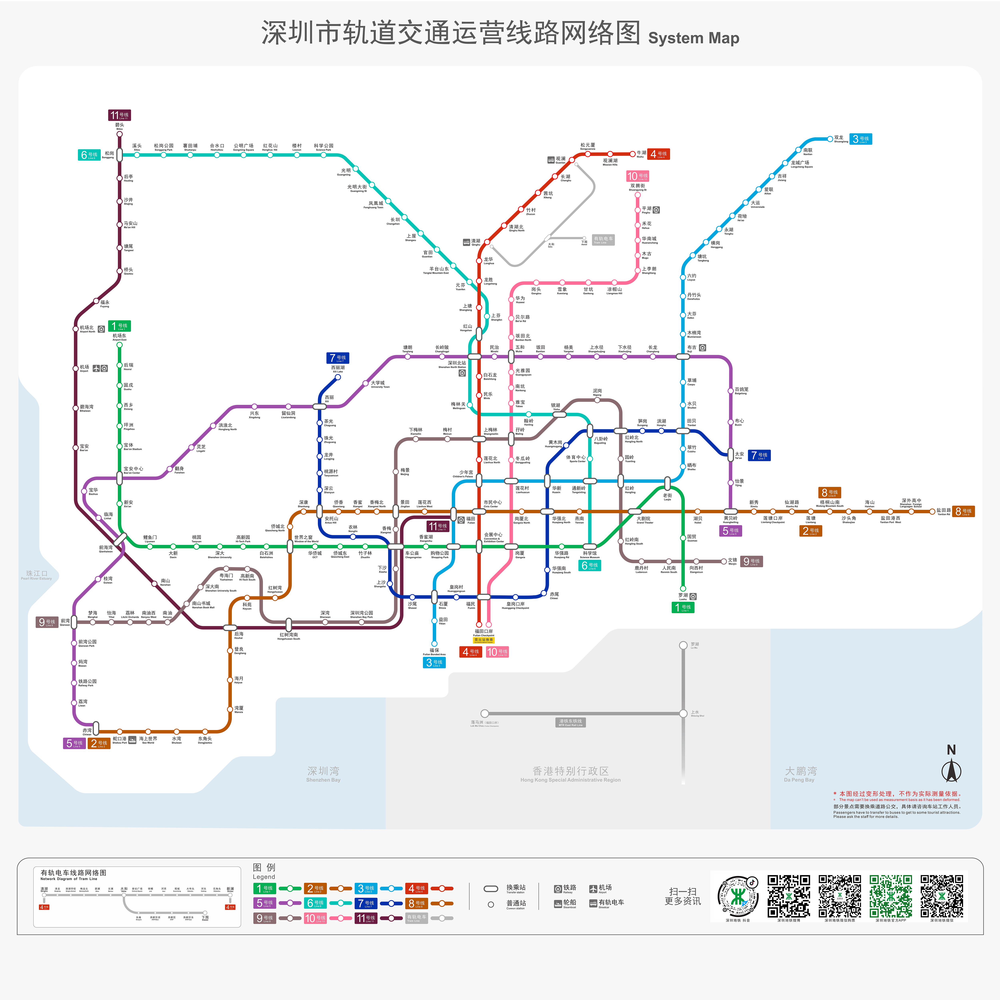

# 🚄交通

## 🚌校园巴士

<a href="./workday.html">工作日</a>

<a href="./holiday.html">节假日</a>

<ClientOnly>

</ClientOnly>

### 校园巴士线路图（2020年内9月19日起）

[点击这里](https://assets.sustech.online/documents/campus-map/南方科技大学校园地图-v2-2.pdf)下载矢量PDF版本。

## 来往南方科技大学的交通
### 公交

* 南方科技大学（公交站）：43路、74路、81路、M369路、M459路
* 南山智园北（公交站）：43路、74路、81路、M369路、M459路
* 塘朗地铁站（公交站）：B818路、M217路、M343路、M393路、M460路、M554路、高峰专线119路、高峰专线120路、高峰专线150路

### 地铁
-  5号线塘朗站，B出口
-  5号线长岭陂，A出口

## 市内公共交通

### 深圳地铁线路图（2020年9月起）

### 乘坐市内公共交通

#### 深圳通

可用于乘坐市内的公交，地铁，也可在七十一等便利店消费。

可购买实体卡，或在部分智能手机上开卡。在微信中也有“深圳通”小程序二维码。

#### 深圳地铁乘车码

可用于乘坐深圳地铁，在微信中搜索“腾讯乘车码”小程序。

#### 交通联合卡（TU）

深圳市公共交通均支持交通联合卡（TU），不过没有深圳通的折扣。

## 来往附近城市的交通

### 香港

1. 乘地铁 往黄贝岭方向至深圳北站，转高铁。
2. 乘地铁 往黄贝岭方向至深圳北站，转 往福田口岸方向至福田口岸。
3. 乘公交81路，转M474路至深圳湾口岸。

### 广州

1. 乘地铁 往黄贝岭方向至深圳北站，转高铁。
2. 乘地铁 往赤湾方向至前海湾站，转往碧头方向至机场北，转穗莞深城际。
