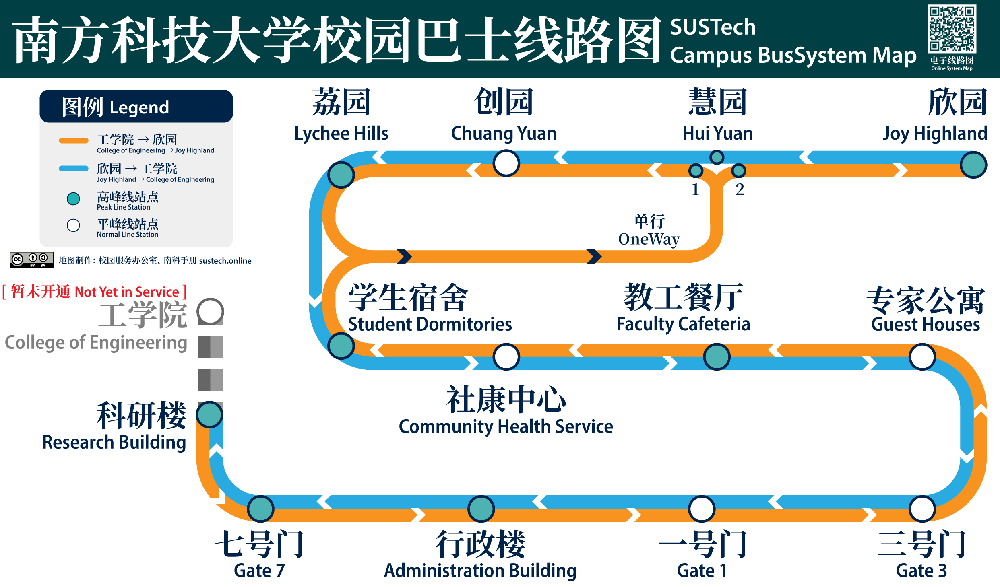

# 🚌校园巴士时刻表 SUSTech Campus Bus Info

## 路线图 System Map

## 车辆位置 Bus Realtime Loaction

位置每5秒自动刷新。Location refreshes automatically every 5 seconds

<Realtimemap></Realtimemap>

## 时间表 Timetable

  <object-selector :objs="{
    '工作日 Workday': true,
    '节假日 Holiday': false
    }" v-slot="weekdayProps">
     
    <object-selector :objs="weekdayProps.selected ? {
        'Line 1 号线 │ 工学院方向 To COE': '/bus_times/one_down.json',
        'Line 1 号线 │ 欣园方向 To Joy Highland': '/bus_times/one_up.json',
        'Line 2 号线 │ 科研楼方向 To Research Building': '/bus_times/two_down.json',
        'Line 2 号线 │ 欣园方向 To Joy Highland': '/bus_times/two_up.json',
      } : {
        'Line 1 号线 │ 工学院方向  To COE': '/bus_times/one_down_holiday.json',
        'Line 1 号线 │ 欣园方向 To Joy Highland': '/bus_times/one_up_holiday.json'
      }" v-slot="routeProps">
      <data-request :path="routeProps.selected" v-slot="{ data }">
        <bus-timer v-if="data" v-bind="data"></bus-timer>
        <grid-list v-if="data" :data="data.times">
        </grid-list>
      </data-request>
    </object-selector>
  </object-selector>

<Adsense_unit>
</Adsense_unit>